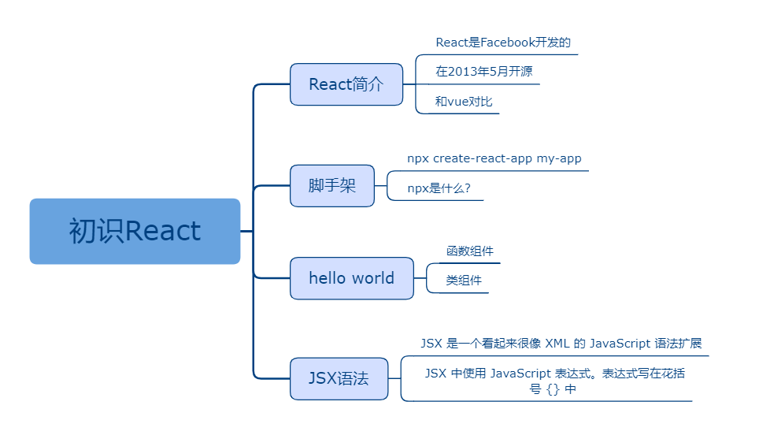

## 初识React

### 课程目标

1. React简介
2. 脚手架
3. hello world
4. JSX语法

### 知识点

#### 1.React简介

React 起源于 Facebook 的内部项目，因为该公司对市场上所有 JavaScript MVC 框架，都不满意，就决定自己写一套，用来架设 Instagram 的网站（https://www.instagram.com/）。做出来以后，发现这套东西很好用，就在2013年5月开源了（https://github.com/facebook/react）。由于 React 的设计思想极其独特，属于革命性创新，性能出众，代码逻辑却非常简单。所以，越来越多的人开始关注和使用，认为它可能是将来 Web 开发的主流工具。

官方网站：https://react.docschina.org/

英文官方网站：https://reactjs.org/

目前的版本： 16.13.1

github star数：149k  (vue是164k)

npm下载量对比：https://npmcharts.com/compare/react,vue

  
#### 2.脚手架

create-react-app官网：https://github.com/facebook/create-react-app

npm 从5.2版开始，增加了 npx 命令。

npx 还能避免全局安装的模块。

npx 将create-react-app下载到一个临时目录，使用以后再删除。所以，以后再次执行上面的命令，会重新下载create-react-app。

每次使用的都是最新版本，脚手架使用的频率并不高，一个大项目使用一次就够了。

```js
npx create-react-app my-app
cd my-app
npm start
```


#### 3.hello world

类组件：
```js
import React, { Component } from 'react'

export default class Home extends Component {
  render() {
    return (
      <div>
        hello world!
      </div>
    )
  }
}
```

函数组件：
```js
import React from 'react'

const Home = () => {
  return (
    <div>
      hello world!
    </div>
  )
}

export default Home

```

#### 4.JSX语法

React发明了JSX，利用HTML语法来创建虚拟DOM。

React的核心机制之一就是可以在内存中创建虚拟的DOM元素。以此来减少对实际DOM的操作从而提升性能。

JSX 即Javascript XML，它是对JavaScript 语法扩展。

我们建议在 React 中配合使用 JSX，JSX 可以很好地描述 UI 应该呈现出它应有交互的本质形式。

JSX 是一个看起来很像 XML 的 JavaScript 语法扩展。

我们可以在 JSX 中使用 JavaScript 表达式。表达式写在花括号 {} 中。

在 JSX 中不能使用 if else 语句，但可以使用 conditional (三元运算) 表达式来替代。

### 授课思路

    

### 案例作业

1.阅读官网  
2.使用脚手架创建项目  
3.编写hello world页面  
4.预习加加减减  

