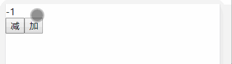
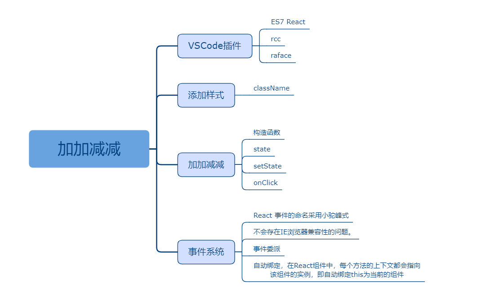

## 二、加加减减

### 课程目标

1. VSCode插件
2. 添加样式
3. 加加减减
4. 事件系统

### 知识点

#### 1.VSCode插件

ES7 React/Redux/GraphQL/React-Native snippets

快捷方式：
创建类组件: rcc
创建函数数据：raface
  
#### 2.添加样式

使用className，而不是class

```js
import React from 'react'

const Home = () => {
  return (
    <div className="m-title">
      hello world!
      <span className="m-name">徐</span>
    </div>
  )
}

export default Home
```

想使用sass同学可以安装node-sass
```js
yarn add node-sass
```
把样式文件改成scss就行了

```scss
.m-title{
  color: red;
  .m-name{
    color: lightblue;
  }
}
```


#### 3.加加减减
constructor构造函数在组件创建时执行，super代表调用父类的构造函数，Component就是父类。

state是状态的意思，类似于vue的里的data。

修改state使用setState方法。

onClick是React合成事件。

```js
import React, { Component } from 'react'

export default class Home extends Component {
  constructor(props) {
    super(props)
    this.state = {
      count: 0
    }
  }

  handleSub() {
    let { count } = this.state
    count--
    this.setState({
      count
    })
  }

  handleAdd() {
    let { count } = this.state
    count++
    this.setState({
      count
    })
  }

  render() {
    let { count } = this.state
    return (
      <div>
        <div>{count}</div>
        <button onClick={() => this.handleSub()}>减</button>
        <button onClick={() => this.handleAdd()}>加</button>
      </div>
    )
  }
}

```

  


#### 4.事件系统

React 元素的事件处理和 DOM 元素的很相似，但是有一点语法上的不同：

React 事件的命名采用小驼峰式（camelCase），而不是纯小写。
使用 JSX 语法时你需要传入一个函数作为事件处理函数，而不是一个字符串。

不会存在IE浏览器兼容性的问题。

在React底层，主要对合成事件做了两件事情：事件委派和自动绑定。

1. 事件委派

React中并不是把事件处理函数绑定到当前DOM上，而是把所有的事件绑定到结构的最外层，使用统一的事件监听器。
这个事件监听器上维持了一个映射来保存所有组件内部的事件监听和处理函数。
组件挂载和卸载时，只是在统一事件监听器上插入删除一些对象。

2. 自动绑定

在React组件中，每个方法的上下文都会指向该组件的实例，即自动绑定this为当前的组件。而且React会对这种引用缓存，以达到CPU和内存的最大优化。

vue里是使用@click绑定点击事件。

### 授课思路

    

### 案例作业

1.上网阅读相关质料  
2.制作加加减减  
3.添加样式  
4.预习列表渲染  

