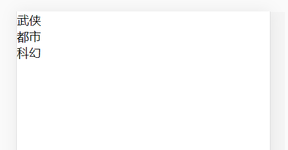
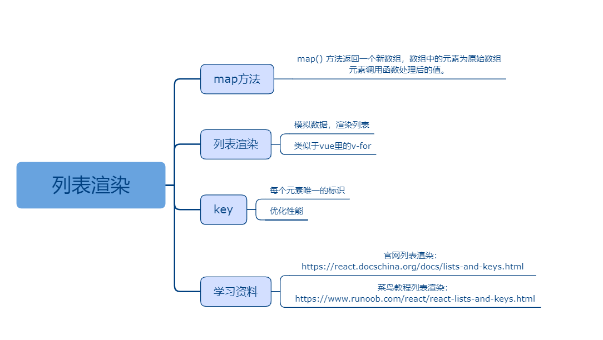

## 三、列表渲染

### 课程目标

1. map方法
2. 列表渲染
3. key
4. 学习资料

### 知识点

#### 1.map方法

map() 方法返回一个新数组，数组中的元素为原始数组元素调用函数处理后的值。

map() 方法按照原始数组元素顺序依次处理元素。

注意： map() 不会对空数组进行检测。

注意： map() 不会改变原始数组。

```js
    let arr = [1, 2, 3]
    let arr2 = arr.map(item => item * 2)
    console.log(arr2)
```
  
#### 2.列表渲染

在state里定义一个数组，包含id
把数组里的字段渲染到页面上
类似于vue里的v-for

```js
import React, { Component } from 'react'

export default class Home extends Component {
  constructor(props) {
    super(props)
    this.state = {
      list: [
        {
          id: 0,
          title: '武侠'
        },
        {
          id: 1,
          title: '都市'
        },
        {
          id: 2,
          title: '科幻'
        }
      ]
    }
  }
  render() {
    let { list } = this.state

    let listDom = list.map(item => (
      <div key={item.id}>{item.title}</div>
    ))

    return (
      <div>
        {listDom}
      </div>
    )
  }
}

```
  

#### 3.key
key 帮助 React 识别哪些元素改变了，比如被添加或删除。因此你应当给数组中的每一个元素赋予一个确定的标识。
一个元素的 key 最好是这个元素在列表中拥有的一个独一无二的字符串。通常，我们使用数据中的 id 来作为元素的 key。

这个 key 必须是每个元素唯一的标识。key可以在DOM 中的某些元素被增加或删除的时候帮助 React 识别哪些元素发生了变化，提高渲染性能。所以需要给数组每一个元素增加一个唯一的标识。
一般可以将后台返回的ID作为key值，因为后台返回的ID都是唯一的。

#### 4.学习资料

官网列表渲染：
https://react.docschina.org/docs/lists-and-keys.html

菜鸟教程列表渲染：
https://www.runoob.com/react/react-lists-and-keys.html

### 授课思路

    

### 案例作业

1.上网阅读相关质料  
2.列表渲染    
3.预习条件渲染  

