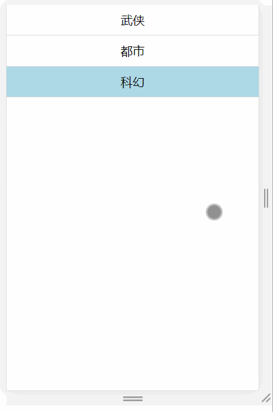

## 四、条件渲染

### 课程目标

1. 条件渲染dom
2. 条件渲染样式
3. key
4. 学习资料

### 知识点

#### 1.条件渲染dom

dom的显示和隐藏：hello world！的显示与隐藏。
文案的切换：按钮文案的变化。
属性的切换：控制密码的显示隐藏。
在vue里使用v-if v-show。

```js
import React, { Component } from 'react'

export default class Home extends Component {
  constructor(props) {
    super(props)
    this.state = {
      visible: false
    }
  }

  handleVisible() {
    let { visible } = this.state
    this.setState({
      visible: !visible
    })
  }

  render() {
    let { visible } = this.state
    return (
      <div>
        <input type={ visible ? "text" : "password" } ></input>
        <button onClick={() => this.handleVisible()}>{ visible ? '隐藏' : '显示' }</button>
        {
          visible ? <div>hello world!</div> : null
        }
      </div>
    )
  }
}

```

  
  
#### 2.条件渲染样式
根据状态控制样式：tab切换的高亮显示。

```js
import React, { Component } from 'react'

export default class Home extends Component {
  constructor(props) {
    super(props)
    this.state = {
      list: [
        {
          id: 0,
          title: '武侠'
        },
        {
          id: 1,
          title: '都市'
        },
        {
          id: 2,
          title: '科幻'
        }
      ],
      currentId: 0
    }
  }

  handleNav(currentId) {
    this.setState({
      currentId
    })
  }

  render() {
    let { list, currentId } = this.state

    let listDom = list.map(item => (
      <div key={item.id} className={ `m-nav-item ${currentId === item.id ? 'active' : ''}` } onClick={() => this.handleNav(item.id)}>{item.title}</div>
    ))

    return (
      <div>
        {listDom}
      </div>
    )
  }
}
```

```css
.m-nav-item{height: 40px;line-height: 40px;border-bottom: 1px solid #ddd;text-align: center;}
.m-nav-item.active{background: lightblue;}
```

  

#### 3.对话框

控制dom的显示和隐藏：dialog对话框。

div水平垂直居中。

```js
import React, { Component } from 'react'

export default class Home extends Component {
  constructor(props) {
    super(props)
    this.state = {
      visible: false
    }
  }

  handleVisible() {
    let { visible } = this.state
    this.setState({
      visible: !visible
    })
  }

  handleClose() {
    this.setState({
      visible: false
    })
  }

  render() {
    let { visible } = this.state
    return (
      <div>
        <button onClick={() => this.handleVisible()}>{ visible ? '隐藏' : '显示' }</button>
        {
          visible ? 
          <div className="m-dialog-wrap">
            <div className="m-dialog">
              <div className="m-dialog-header">
                <div className="m-dialog-title">添加</div>
                <div className="m-dialog-close" onClick={() => this.handleClose()}>X</div>
              </div>
            </div>
          </div> : null
        }
      </div>
    )
  }
}

```

```css
.m-dialog-wrap{display: flex; position: fixed;top: 0;left: 0;right: 0;bottom: 0;background: rgba(0, 0, 0, 0.5);}
.m-dialog{margin: auto;min-width: 300px;min-height: 240px;background: #fff;border-radius: 10px;}
.m-dialog-header{display: flex;height: 40px;line-height: 40px;border-bottom: 1px solid #ddd;}
.m-dialog-title{flex: 1;padding: 0 0 0 10px;}
.m-dialog-close{width: 40px;text-align: center;cursor: pointer;}
```

   


#### 4.学习资料

官网条件渲染：
https://react.docschina.org/docs/conditional-rendering.html

菜鸟教程条件渲染：
https://www.runoob.com/react/react-conditional-rendering.html

### 授课思路

    

### 案例作业

1.上网阅读相关质料  
2.制作对话框    
3.预习受控组件  

