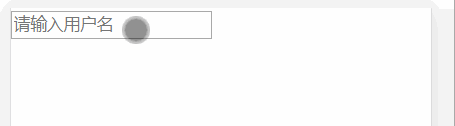

## 五、受控组件

### 课程目标

1. 什么是受控组件
2. 文本框受控组件
3. 如何获取受控组件的值
4. 学习资料

### 知识点

#### 1.什么是受控组件

在 HTML 中，表单元素（如&lt;input>、 &lt;textarea> 和 &lt;select>）之类的表单元素通常自己维护 state，并根据用户输入进行更新。而在 React 中，可变状态（mutable state）通常保存在组件的 state 属性中，并且只能通过使用 setState()来更新。

我们可以把两者结合起来，使 React 的 state 成为“唯一数据源”。渲染表单的 React 组件还控制着用户输入过程中表单发生的操作。被 React 以这种方式控制取值的表单输入元素就叫做“受控组件”。 

假设我们现在有一个表单，表单中有一个input标签，input的value值必须是我们设置在constructor构造函数的state中的值，然后，通过onChange触发事件来改变state中保存的value值，这样形成一个循环的回路影响。也可以说是React负责渲染表单的组件仍然控制用户后续输入时所发生的变化。

就像上面这样，input中的value值通过state值获取，onChange事件改变state中的value值，input中的value值又从state中获取。。。

类似于vue中的v-model
  
#### 2.文本框受控组件
input框的值来至state，onChange事件修改state。

```js
import React, { Component } from 'react'

export default class Home extends Component {
  constructor(props) {
    super(props)
    this.state = {
      username: ''
    }
  }

  handleUsername(e) {
    this.setState({
      username: e.target.value
    })
  }

  render() {
    let { username } = this.state
    return (
      <div>
        <div>
          <input value={username} onChange={(e) => this.handleUsername(e)} placeholder="请输入用户名"></input>
        </div>
      </div>
    )
  }
}

```

  

#### 3.如何获取受控组件的值

从state里解构。

```js
import React, { Component } from 'react'

export default class Home extends Component {
  constructor(props) {
    super(props)
    this.state = {
      username: '',
      password: ''
    }
  }

  handleUsername(e) {
    this.setState({
      username: e.target.value
    })
  }

  handlePasswrod(e) {
    this.setState({
      password: e.target.value
    })
  }

  handleLogin() {
    let { username, password } = this.state

    console.log(username, password)
  }

  render() {
    let { username, password } = this.state
    return (
      <div>
        <div>
          <input value={username} onChange={(e) => this.handleUsername(e)} placeholder="请输入用户名"></input>
        </div>
        <div>
          <input value={password} onChange={(e) => this.handlePasswrod(e)} placeholder="请输入密码" type="password"></input>
        </div>
        <button onClick={() => this.handleLogin()}>登录</button>
      </div>
    )
  }
}


```

   


#### 4.学习资料

官网受控组件：
https://zh-hans.reactjs.org/docs/forms.html#controlled-components

### 授课思路

    

### 案例作业

1.上网阅读相关质料  
2.制作对话框    
3.预习受控组件  

