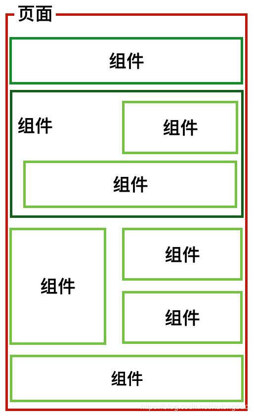
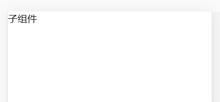
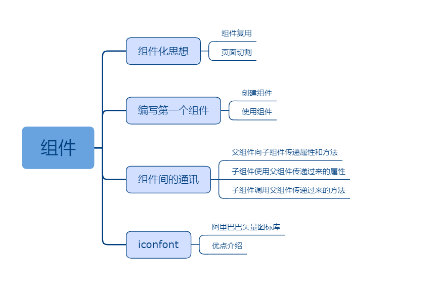

## 六、组件

### 课程目标

1. 组件化思想
2. 编写第一个组件
3. 组件间的通讯
4. iconfont

### 知识点

#### 1.组件化思想
组件化就是把传统的一张大网页拆分成很多小组件，有些组件可以反复使用，有些组件也许只使用一次，拆分成很多组件的目的就是使页面解构更清晰更好维护，也方便多人协作开发一个大项目。

对比vue的单文件组件。

组件作为React的核心内容，是View的重要组成部分，每一个View页面都由一个或多个组件构成，可以说组件是React应用程序的基石。在React的组件构成中，按照状态来分可以分为有状态组件和无状态组件。
所谓无状态组件，就是没有状态控制的组件，只做纯静态展示的作用，无状态组件是最基本的组件形式，它由属性props和渲染函数render构成。由于不涉及到状态的更新，所以这种组件的复用性也最强。
有状态组件是在无状态组件的基础上增加了组件内部状态管理，有状态组件通常会带有生命周期lifecycle，用以在不同的时刻触发状态的更新，有状态组件被大量用在业务逻辑开发中。

 
  
#### 2.编写第一个组件
创建components文件夹。
创建Icon.js文件。自定义组件的首字母大写，组件文件首字母也大写。

components/Icon.js:
```js
import React, { Component } from 'react'

export default class Icon extends Component {
  render() {
    return (
      <span>子组件</span>
    )
  }
}

```

父组件引入子组件,并在JSX里使用子组件。
```js
import React, { Component } from 'react'
import Icon from './components/Icon'

export default class Home extends Component {
  render() {
    return (
      <div>
        <Icon></Icon>
      </div>
    )
  }
}
```

 

#### 3.组件间的通讯

父组件向子组件传递属性和方法。
子组件使用父组件传递过来的属性。
子组件调用父组件传递过来的方法。


父组件：
```js
import React, { Component } from 'react'
import Icon from './components/Icon'

export default class Home extends Component {
  constructor(props) {
    super(props)
    this.state = {
      visible: true
    }
  }

  handleVisible() {
    const { visible } = this.state
    this.setState({
      visible: !visible
    })
  }

  render() {
    const { visible } = this.state
    return (
      <div>
        <Icon name={ visible ? 'show' : 'hide' } className="m-eye-icon" onClick={ () => this.handleVisible() }></Icon>
        <Icon></Icon>
        <Icon name="home" className="m-home-icon"></Icon>
      </div>
    )
  }
}
```

子组件：
```js
import React, { Component } from 'react'

export default class Icon extends Component {
  render() {
    let { name = 'zhanwei', className = '', onClick = () => {} } = this.props
    return (
      <span className={`icon iconfont icon-${name} ${className}`} onClick={onClick}></span>
    )
  }
}

```

 


#### 4.iconfont
阿里巴巴矢量图标库：
https://www.iconfont.cn/

使用iconfont图标代替图片图标，能减少文件体积、降低服务器请求数，节约宽带资源。


### 授课思路

    

### 案例作业

1.上网阅读相关质料  
2.编写控制密码显示隐藏的Icon组件    
3.预习props类型检查  

