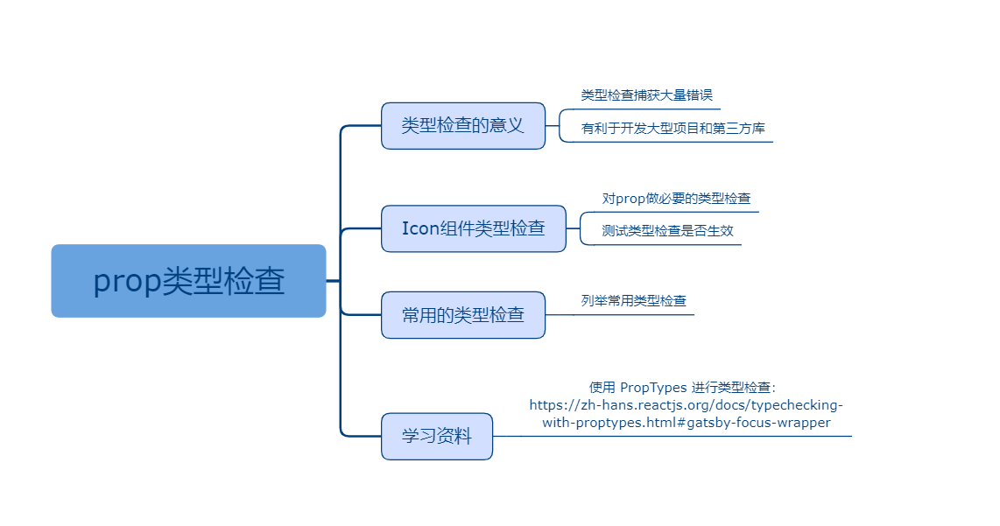

## 七、prop类型检查

### 课程目标

1. 类型检查的意义
2. Icon组件类型检查
3. 常用的类型检查
4. 学习资料

### 知识点

#### 1.类型检查的意义
随着你的应用程序不断增长，你可以通过类型检查捕获大量错误。
React 内置了一些类型检查的功能。要在组件的 props 上进行类型检查，你只需配置特定的 propTypes 属性。
PropTypes 提供一系列验证器，可用于确保组件接收到的数据类型是有效的。
传入的 prop 值类型不正确时，JavaScript 控制台将会显示警告。
出于性能方面的考虑，propTypes 仅在开发模式下进行检查。
  
#### 2.Icon组件类型检查

对prop做必要的类型检查。

components/Icon.js:
```js
import React, { Component } from 'react'
import PropTypes from 'prop-types'

export default class Icon extends Component {
  render() {
    let { name = 'zhanwei', className = '', onClick = () => {} } = this.props
    return (
      <span className={`icon iconfont icon-${name} ${className}`} onClick={onClick}></span>
    )
  }
}

Icon.propTypes = {
  name: PropTypes.string.isRequired,  //name必须传string类型，且必须传
  className: PropTypes.string,   //className必须是string类型，可以不传
  onClick: PropTypes.func,       //onClick必须是函数类型
}

```

父组件：
```js
import React, { Component } from 'react'
import Icon from './components/Icon'

export default class Home extends Component {
  constructor(props) {
    super(props)
    this.state = {
      visible: true
    }
  }

  handleVisible() {
    const { visible } = this.state
    this.setState({
      visible: !visible
    })
  }

  render() {
    const { visible } = this.state
    return (
      <div>
        <Icon name={ visible ? 'show' : 'hide' } className="m-eye-icon" onClick={ () => this.handleVisible() }></Icon>
        <Icon name={1}></Icon>
        <Icon></Icon>
        <Icon name="home" onClick={1}></Icon>
      </div>
    )
  }
}
```

 

#### 3.常用的类型检查

```js
  optionalArray: PropTypes.array,
  optionalBool: PropTypes.bool,
  optionalFunc: PropTypes.func,
  optionalNumber: PropTypes.number,
  optionalObject: PropTypes.object,
  optionalString: PropTypes.string,
  children: PropTypes.element,
```


#### 4.学习资料
使用 PropTypes 进行类型检查：
https://zh-hans.reactjs.org/docs/typechecking-with-proptypes.html#gatsby-focus-wrapper


### 授课思路

    

### 案例作业

1.上网阅读相关质料  
2.给Icon组件添加类型检查    
3.预习生命周期  

