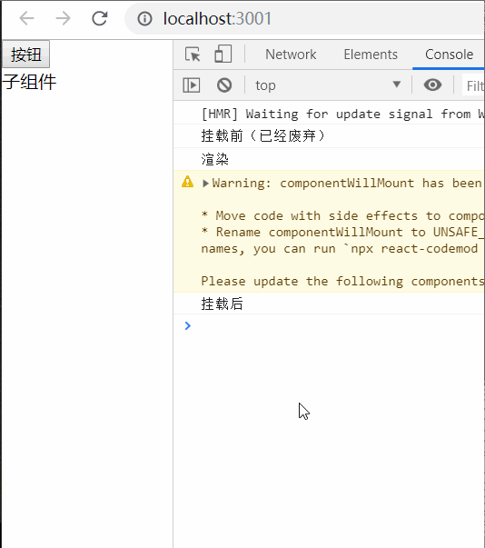
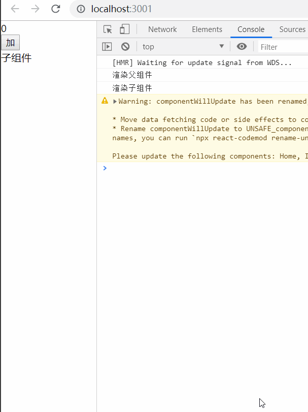
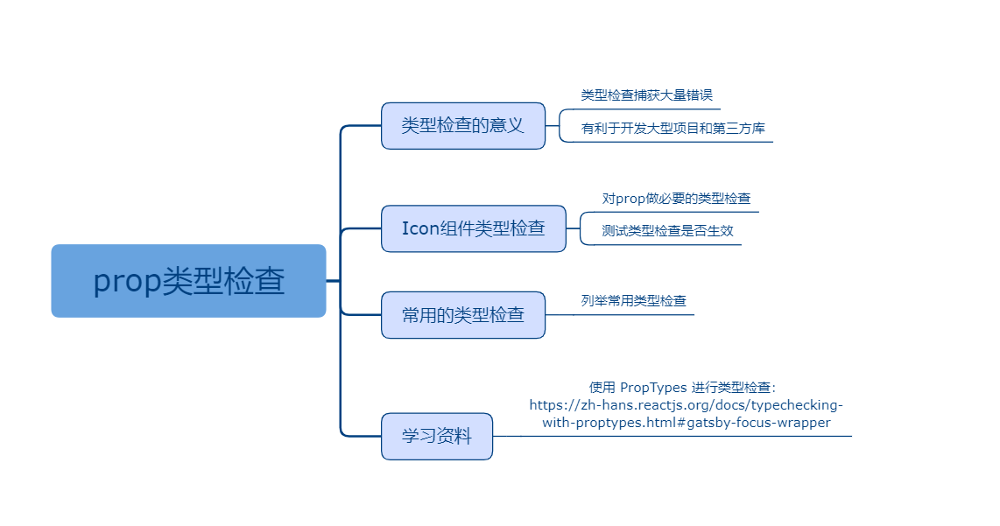

## 八、生命周期

### 课程目标

1. 什么是生命周期
2. 挂载相关的生命周期
3. 更新相关的生命周期
4. shouldComponentUpdate

### 知识点

#### 1.什么是生命周期
生命周期函数（钩子函数）通俗的说就是在某一时刻会被自动调用执行的函数。

生命周期（life cycle）的概念广泛运用于各行各业。从广义上来说，生命周期泛指自然界和
人类社会中各种客观事物的阶段性变化及其规律。自然界的生命周期，可分为出生、成长、成熟、
衰退直到死亡。

React 组件的生命周期根据广义定义描述，可以分为挂载、渲染和卸载这几个阶段。当渲染
后的组件需要更新时，我们会重新去渲染组件，直至卸载。
因此，我们可以把 React 生命周期分成两类：
  1)当组件在挂载或卸载时；
  2)当组件接收新的数据时，即组件更新时。
  
#### 2.挂载相关的生命周期

componentWillMount，componentDidMount， render，componentWillUnmount

components/Icon.js:
```js
import React, { Component } from 'react'

export default class Icon extends Component {
  componentWillUnmount() {
    console.log('卸载前')
  }
  render() {
    return (
      <div>
        子组件
      </div>
    )
  }
}
```

父组件：
```js
import React, { Component } from 'react'
import Icon from './components/Icon'

export default class Home extends Component {
  constructor(props) {
    super(props)
    this.state = {
      visible: true
    }
  }

  handleVisible() {
    let { visible } = this.state
    this.setState({
      visible: !visible
    })
  }

  componentWillMount() {
    console.log('挂载前（已经废弃）')
  }

  componentDidMount() {
    console.log('挂载后')
  }

  render() {
    console.log('渲染')
    let { visible } = this.state
    return (
      <div>
        <div>
          <button onClick={ () => this.handleVisible() }>按钮</button>
        </div>
        { visible ? <Icon></Icon> : null }
      </div>
    )
  }
}
```

  

#### 3.更新相关的生命周期

componentWillUpdate、componentDidUpdate

父组件：
```js
import React, { Component } from 'react'
import Icon from './components/Icon'

export default class Home extends Component {
  constructor(props) {
    super(props)
    this.state = {
      count: 0
    }
  }

  handleAdd() {
    let { count } = this.state
    this.setState({
      count: count + 1
    })
  }

  componentWillUpdate() {
    console.log('父组件更新前（已废弃）')
  }

  componentDidUpdate() {
    console.log('父组件更新后')
  }

  render() {
    console.log('渲染父组件')
    let { count } = this.state
    return (
      <div>
        <div>
          {count}
        </div>
        <div>
          <button onClick={ () => this.handleAdd() }>加</button>
        </div>
        <Icon></Icon>
      </div>
    )
  }
}

```

子组件：
```js
import React, { Component } from 'react'

export default class Icon extends Component {
  componentWillUpdate() {
    console.log('子组件更新前（已废弃）')
  }

  componentDidUpdate() {
    console.log('子组件更新后')
  }
  render() {
    console.log('渲染子组件')
    return (
      <div>
        子组件
      </div>
    )
  }
}

```

  


#### 4.shouldComponentUpdate

用于性能优化，shouldComponentUpdate返回true则更新，返回false则不更新！
人为决定是否更新，避免了不必要的更新，从而优化了性能！

父组件：
```js
import React, { Component } from 'react'
import Icon from './components/Icon'

export default class Home extends Component {
  constructor(props) {
    super(props)
    this.state = {
      count: 0,
      visible: true
    }
  }

  handleAdd() {
    let { count } = this.state
    this.setState({
      count: count + 1
    })
  }

  handleVisible() {
    this.setState({
      visible: !this.state.visible
    })
  }

  render() {
    console.log('渲染父组件')
    let { count, visible } = this.state
    return (
      <div>
        <div>
          {count}
        </div>
        <div>
          <button onClick={ () => this.handleAdd() }>加</button>
          <button onClick={ () => this.handleVisible() }>{ visible ? '隐藏' : '显示'}</button>
        </div>
        <Icon visible={visible}></Icon>
      </div>
    )
  }
}

```

子组件:
```js
import React, { Component } from 'react'

export default class Icon extends Component {

  shouldComponentUpdate(nextProps, nextState) {
    if (this.props.visible !== nextProps.visible) {
      return true
    } else {
      return false
    }
  }

  render() {
    let { visible } = this.props
    console.log('渲染子组件')
    return (
      <div>
        子组件:{visible ? '显示' : '隐藏' }
      </div>
    )
  }
}

```


### 授课思路

    

### 案例作业

1.上网阅读相关质料  
2.练习挂载相关的生命周期    
3.预习tab切换  

