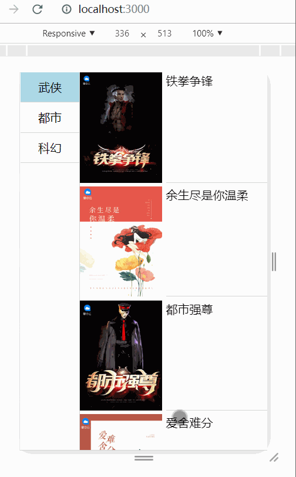
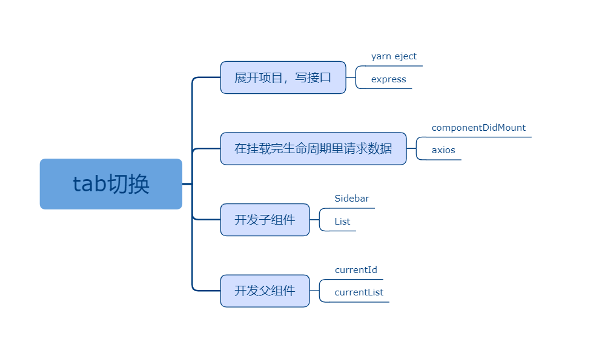

## 九、tab切换

### 课程目标

1. 展开项目，写接口
2. 在挂载完生命周期里请求数据
3. 开发子组件
4. 开发父组件

### 知识点

#### 1.展开项目，写接口

运行下面的命令可以展开项目，如何展开后报错，可以把node_modules删了重新装包
```js
yarn eject
```

devServer里写接口：
```js
//列表接口
app.get('/api/list', (req, res) => {
  res.send({
    code: 200,
    data: bookMallData,
    message: '列表'
  })
})
```
  
#### 2.在挂载完生命周期里请求数据

axios语法。
生命周期。

```js
import React, { Component } from 'react'
import axios from 'axios'

export default class Home extends Component {
  constructor(props) {
    super(props)
    this.state = {
      list: [],
      currentId: 0,
      currentList: []
    }
  }

  componentDidMount() {
    axios({
      url: '/api/list'
    }).then(res => {
      if (res.data.code === 200) {
        this.setState({
          list: res.data.data,
          currentList: res.data.data[0].list
        })
      }
    })
  }

  render() {
    return (
      <div className="m-wrap">
      </div>
    )
  }
}

``` 

#### 3.开发子组件

Sidebar.js：
```js
import React, { Component } from 'react'

export default class Sidebar extends Component {
  render() {
    let { list, currentId } = this.props
    let listDom = list.map(item => (
      <div key={item.id} 
        className={"m-sidebar-item " + (currentId === item.id ? 'active' : '')}
        onClick={() => this.props.onClick(item.id)}>{item.title}</div>
    ))
    return (
      <div className="m-sidebar">
        {listDom}
      </div>
    )
  }
}

```

List.js：
```js
import React, { Component } from 'react'

export default class List extends Component {
  render() {
    let { currentList } = this.props

    let currentListDom = currentList.map(item => (
      <div key={item.id} className="m-list-item">
        </img>
        <div className="m-info">{item.title}</div>
      </div>
    ))

    return (
      <div className="m-list">
        {currentListDom}
      </div>
    )
  }
}

```


#### 4.开发父组件

父组件：
```js
import React, { Component } from 'react'
import axios from 'axios'
import Sidebar from './components/Sidebar'
import List from './components/List'

export default class Home extends Component {
  constructor(props) {
    super(props)
    this.state = {
      list: [],
      currentId: 0,
      currentList: []
    }
  }

  handleNav(currentId) {
    let { list } = this.state
    let currentList = list.find(item => item.id === currentId).list
    this.setState({
      currentId,
      currentList
    })
  }

  componentDidMount() {
    axios({
      url: '/api/list'
    }).then(res => {
      if (res.data.code === 200) {
        this.setState({
          list: res.data.data,
          currentList: res.data.data[0].list
        })
      }
    })
  }

  render() {
    let { list, currentId, currentList } = this.state
    return (
      <div className="m-wrap">
        <Sidebar list={list} currentId={currentId} onClick={(id) => this.handleNav(id)}></Sidebar>
        <List currentList={currentList}></List>
      </div>
    )
  }
}

```

    

### 授课思路

    

### 案例作业

1.上网阅读相关质料  
2.练习tab切换  
3.预习todolist

