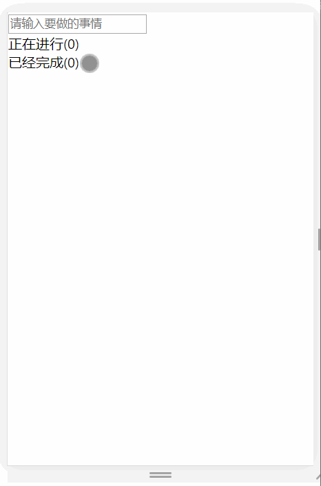
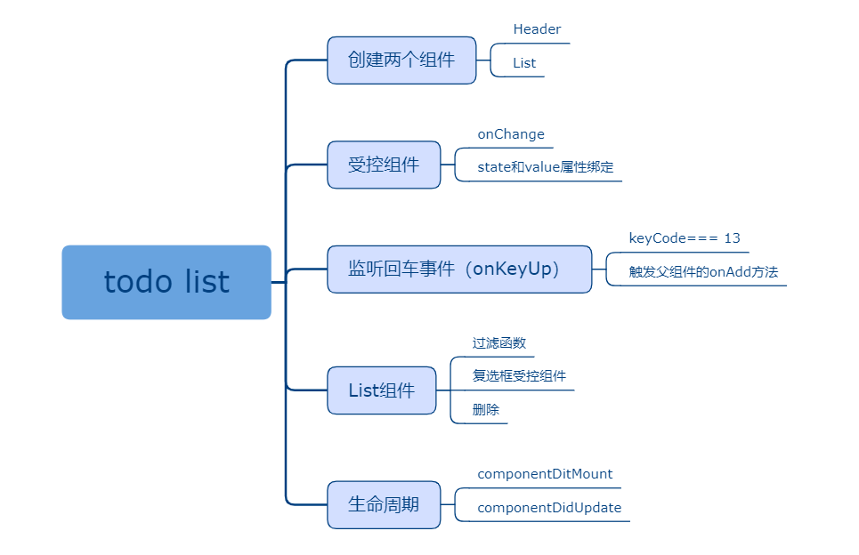

## 十、todolist

### 课程目标

1. todolist是什么
2. 在挂载完生命周期里请求数据
3. 开发子组件
4. 开发父组件

### 知识点

#### 1.todolist是什么

管理用户要做的事件，可以添加事件，把事件标记为正在进行或已经完成，也可以删除事件。

http://www.todolist.cn/

  
#### 2.父组件

管理子组件，核心代码都在父组件。

```js
import React, { Component } from 'react'
import Header from './components/Header'
import List from './components/List'

export default class App extends Component {
  state = {
    list: []
  }

  //向list数组里添加数据
  handleAdd(title) {
    //解构
    let { list } = this.state

    list.push({
      id: Date.now(),  //取当前时间的时间戳
      title: title,
      checked: false,  //不打勾
    })

    //更新list数组
    this.setState({
      list
    })
  }

  //点击复选框事件
  handleCheck(e, id) {
    let list = this.state.list
    //根据id查找下标
    let index = list.findIndex(item => item.id === id)
    //根据下标修改checked属性
    list[index].checked = e.target.checked

    //设置状态
    this.setState({
      list
    })
  }

  //删除
  handleDelete(id) {
    let list = this.state.list
    //找下标
    let index = list.findIndex(item => item.id === id)
    //删除
    list.splice(index, 1)

    //更新状态
    this.setState({
      list
    })
  }

  componentDidUpdate() {
    console.log('更新完')
    let list = this.state.list
    localStorage.setItem('list', JSON.stringify(list))
  }

  componentDidMount() {
    console.log('挂载完')
    let list = JSON.parse(localStorage.getItem('list')) || []
    this.setState({
      list
    })
  }

  render() {
    return (
      <div>
        <Header onAdd={(title) => this.handleAdd(title)}></Header>
        <List 
          title="正在进行" 
          checked={false} 
          list={this.state.list} 
          onCheck={(e, id) => this.handleCheck(e, id)}
          onDelete={(id) => this.handleDelete(id)}></List>
        <List 
          title="已经完成" 
          checked={true} 
          list={this.state.list} 
          onCheck={(e, id) => this.handleCheck(e, id)}
          onDelete={(id) => this.handleDelete(id)}></List>        
      </div>
    )
  }
}

``` 

#### 3.子组件

Header.js：
```js
import React, { Component } from 'react'

export default class Header extends Component {
  state = {
    title: ''
  }

  //受控组件回调函数
  handleInput(e) {
    this.setState({
      title: e.target.value
    })
  }

  //监听回车事件
  handleEnter(e) {
    //点击回车按钮是keyCode=13，13是回车键的ASCII码
    if (e.keyCode === 13) {
      //子组件和父组件通讯
      this.props.onAdd(this.state.title)
      this.setState({
        title: ''
      })
    }
  }

  render() {
    return (
      <div>
        <input 
          value={this.state.title} 
          onChange={(e) => this.handleInput(e)} 
          onKeyUp={(e) => this.handleEnter(e)}
          placeholder="请输入要做的事情"></input>
      </div>
    )
  }
}

```

List.js:
```js
import React, { Component } from 'react'

export default class List extends Component {
  render() {
    //过滤list数组
    let list = this.props.list.filter(item => item.checked === this.props.checked)

    return (
      <div>
        <div>{this.props.title + "(" + list.length + ')'}</div>
        <div>
          {
            //渲染列表
            list.map(item => {
              return (
                <div key={item.id} className="m-list-item">
                  <label className="m-list-info">
                    <input checked={item.checked} onChange={(e) => this.props.onCheck(e, item.id)} type="checkbox"></input>
                    {item.title}
                  </label>
                  <button className="m-delete" onClick={() => this.props.onDelete(item.id)}>删除</button>
                </div>
              )
            })
          }
        </div>
      </div>
    )
  }
}

```


#### 4.效果展示

    

### 授课思路

    

### 案例作业

1.上网阅读相关质料  
2.练习todolist  
3.预习投掷骰子游戏
