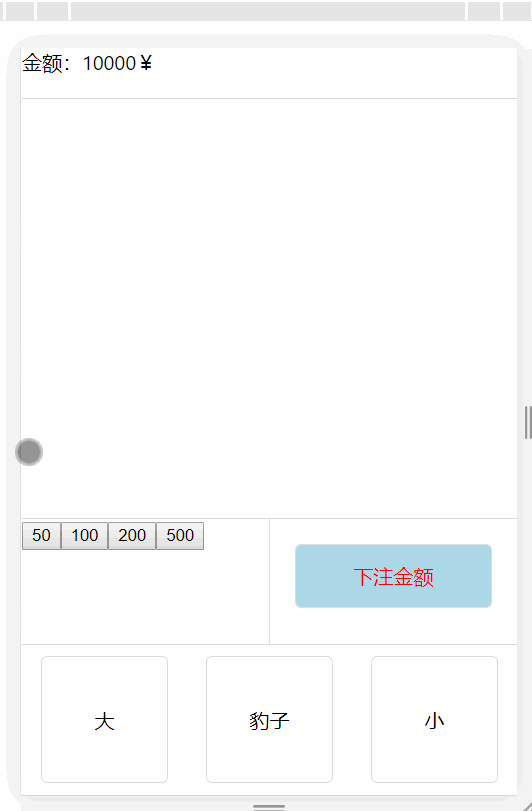
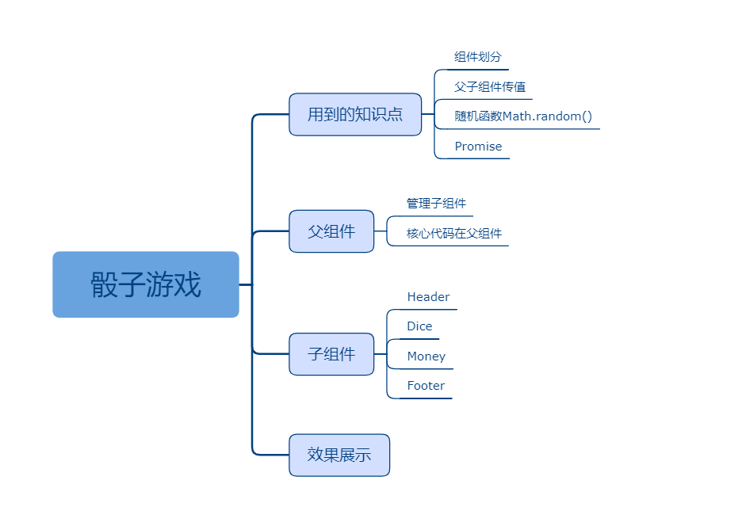

## 十一、骰子游戏

### 课程目标

1. 用到知识点有哪些
2. 父组件
3. 子组件
4. 效果展示

### 知识点

#### 1.用到知识点有哪些
组件划分。
父子组件传值。
随机函数Math.random()。
Promise()。
考察学生的逻辑思维能力，运用所学的知识分析问题，解决问题。
  
#### 2.父组件

核心代码在父组件。

```js
import React, { Component } from 'react'
import Header from './components/Header'
import Dice from './components/Dice'
import Money from './components/Money'
import Footer from './components/Footer'

export default class App extends Component {
  state = {
    score: 10000,
    money: 0,
    guess: 0,  //0:小， 1：大， 2:豹子
    diceArr: []
  }

  //累加金额
  handleAdd(money) {
    this.setState({
      money: this.state.money + money
    })
  }

  //清空金额
  handleClear() {
    this.setState({
      money: 0
    })
  }

  //开始投掷骰子
  async handleStart(guess) {
    console.log('开始:' + guess)

    let arr = []
    await new Promise((resolve) => {
      let count = 0
      let timer = setInterval(() => {
        arr = []
        for (let i = 0; i < 3; i++) {
          arr.push(Math.floor(Math.random() * 6 + 1))
        }
        this.setState({
          diceArr: arr
        })
        count++
        if (count === 20) {
          clearInterval(timer)
          resolve(true)
        }
      }, 50)
    })

    //求和，也可以用for循环
    let sum = arr.reduce((total, item) => { 
      return total + item 
    }, 0)

    console.log(sum)
    let isWin = false
    //赌小，赢了
    if (sum <= 9 && guess === 0) {
      isWin = true
    } else if (sum >= 10 && guess === 1) { //赌大，赢了
      isWin = true
    }

    //赌豹子赢了
    if (arr[0] === arr[1] && arr[1] === arr[2] && guess === 2) {
      isWin = true
    }
    console.log(isWin)

    //赢了
    if (isWin) {
      if (guess !== 2) {
        this.setState({
          score: this.state.score + this.state.money
        })
      } else {
        this.setState({
          score: this.state.score + this.state.money * 24
        })
      }

    } else {  //输了
      this.setState({
        score: this.state.score - this.state.money
      })
    }
  }

  render() {
    return (
      <div className="m-wrap">
        <Header score={this.state.score}></Header>
        <Dice diceArr={this.state.diceArr}></Dice>
        <Money 
          money={this.state.money} 
          onAdd={(money) => this.handleAdd(money)}
          onClear={() => this.handleClear()}></Money>
        <Footer onStart={(guess) => this.handleStart(guess)}></Footer>
      </div>
    )
  }
}

```

#### 3.子组件

Header.js:
```js
import React, { Component } from 'react'

export default class Header extends Component {
  render() {
    return (
      <div className="m-header">
        {this.props.score}
      </div>
    )
  }
}

```

Dice.js:
```js
import React, { Component } from 'react'

export default class Dice extends Component {
  render() {
    return (
      <div className="m-dice">
        {
          this.props.diceArr.map((item, index) => {
            return (
              <div key={index} className="m-dice-item">{item}</div>
            )
          }) 
        }
      </div>
    )
  }
}

```

Money.js:
```js
import React, { Component } from 'react'

export default class Money extends Component {
  render() {
    return (
      <div className="m-money">
        <div className="m-left">
          <button onClick={() => this.props.onAdd(50)}>50</button>
          <button onClick={() => this.props.onAdd(100)}>100</button>
          <button onClick={() => this.props.onAdd(200)}>200</button>
          <button onClick={() => this.props.onAdd(500)}>500</button>
        </div>
        <div className="m-right">
          <button onClick={() => this.props.onClear()}>{this.props.money}</button>
        </div>
      </div>
    )
  }
}

```

Footer.js:
```js
import React, { Component } from 'react'

export default class Footer extends Component {
  render() {
    return (
      <div className="m-footer">
        <button onClick={() => this.props.onStart(1)}>大</button>
        <button onClick={() => this.props.onStart(2)}>豹子</button>
        <button onClick={() => this.props.onStart(0)}>小</button>
      </div>
    )
  }
}


```

#### 4.效果展示

    

### 授课思路

    

### 案例作业

1.上网阅读相关质料  
2.练习骰子游戏  
3.预习路由