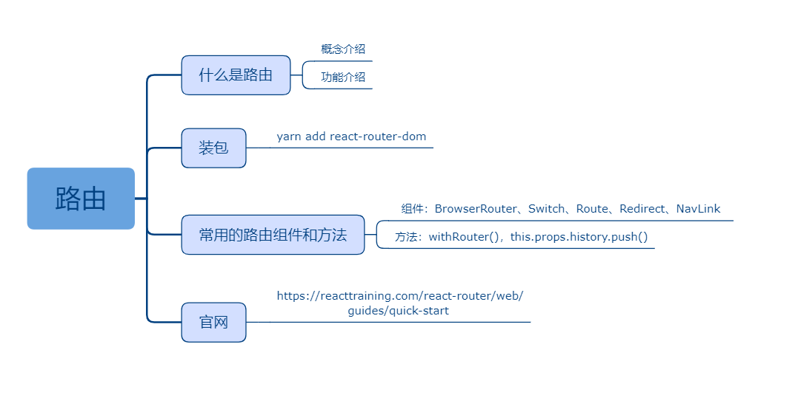

## 十二、路由

### 课程目标

1. 什么是路由
2. 装包
3. 常用的路由组件和方法
4. 官网

### 知识点

#### 1.什么是路由
路由这个概念由后端而来，后端的接口url也叫路由。后来前后端分离了，前端功能越来越强大，有了单页面应用这个概念。前端使用浏览器history api或者hash实现了前端路由，效果就是不依赖后端前端自己实现在单页面中实现多页面的效果。
  
#### 2.装包

```js
yarn add react-router-dom
```

#### 3.常用的路由组件和方法

组件：
BrowserRouter、Switch、Route、Redirect、NavLink

方法：
withRouter()，this.props.history.push()


#### 4.官网

https://reacttraining.com/react-router/web/guides/quick-start  

### 授课思路

    

### 案例作业

1.上网阅读相关质料  
2.练习路由配置  
3.预习登陆（结合路由跳转）
