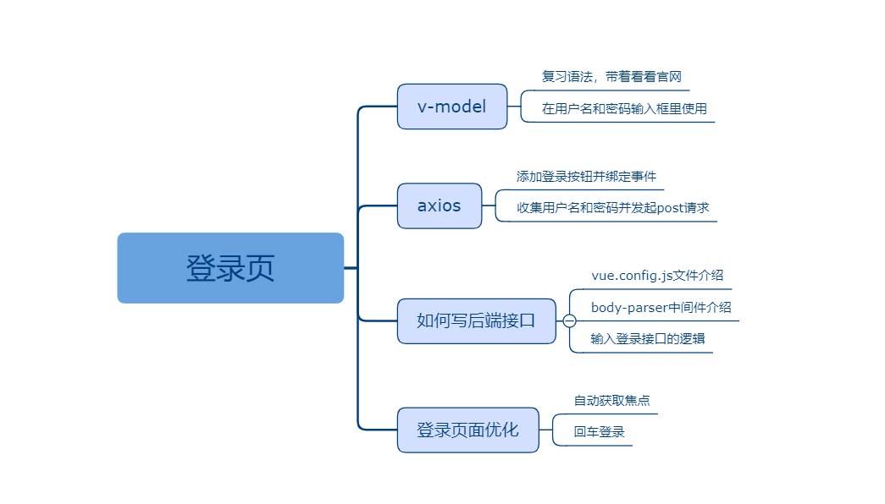
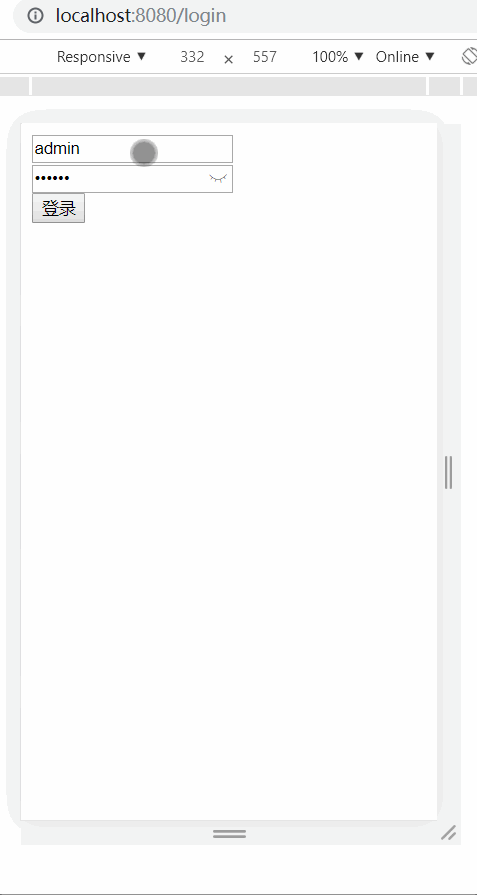

## 登录页

### 课程目标

1. 复习vue脚手架
2. 搭建vue大型项目框架
3. 制作一级路由页面登录页面

### 知识点

#### 1.v-model
  登录页有两个输入框，分别是用户名和密码。用户在输入框里输入的内容可以通过v-model指令和data进行双向数据绑定。
  可以带着学生回忆一下在没有vue的时候怎么做这个功能。在react里没有v-model指令，是通过受控组件来做的，两者有什么
  区别？能否在vue里用受控组件代替v-model?
  
  语法格式：
```js
<input v-model="username">
```

#### 2.axios
  前后端通信的工具，如何安装axios？添加登录按钮，并绑定登录事件，在登录回调函数里如何获取输入框里的值？
  获取到值后，使用axios把用户名和密码发送给后端。

  语法格式：
```js
<button @click="handleLogin">登录</button>

methods: {
  handleLogin() {
    Api.login({ username: this.username, password: this.password }).then(res => {
    })
  }
}
```

#### 3.如何写后端接口
  可以在vue.config.js里写，也可以利用在专高一时所学的知识，搭建后端项目，使用express写接口。
  vue.config.js是vue脚手架的api，会随着项目的启动自动加载。建议安装body-parser解析post请求。

  语法格式：
```js
const bodyParser = require('body-parser')

let userList = [
  {
    id: 0,
    username: 'admin',
    password: '123456'
  },
  {
    id: 1,
    username: 'xu',
    password: '123'
  }
]

module.exports = {
  lintOnSave: false,
  devServer: {
    open: true,
    before(app) {

      app.use(bodyParser.json())

      app.post('/api/login', (req, res) => {
        let { username, password } = req.body
        let user = userList.find(item => item.username === username)
        if (user) {
          if (user.password === password) {
            res.send({
              code: 200,
              data: {
                username
              },
              message: '登录成功'
            })
          } else {
            res.send({
              code: 400,
              message: '密码错误'
            })
          }
        } else {
          res.send({
            code: 400,
            message: '用户名不存在'
          })
        }
      })
    }
  }
}
```

#### 4.登录页面的优化
  首页要做的是用户名输入框自动获取焦点，可以给学生看看百度首页，每次刷新时百度首页的搜索框都会自动获取焦点，这样
  做对用户来说使用起来很方便！
  语法格式：
```js
<input v-model="username" placeholder="请输入用户名" autofocus >
```
  还有一个需要优化的是回车登录。这个也可以举百度的例子，就是用户输入完成后，点击回车键即可搜索！
  在vue里可以使用.enter修饰keyup事件做到这个功能。

  语法格式：
```js
<input @keyup.enter="handleLogin" >
```

### 授课思路



### 案例作业

1.练习v-model  
2.制作登录页  
3.前后端通信  
4.可以包含多个用户  
5.区分用户名错误和密码错误  




