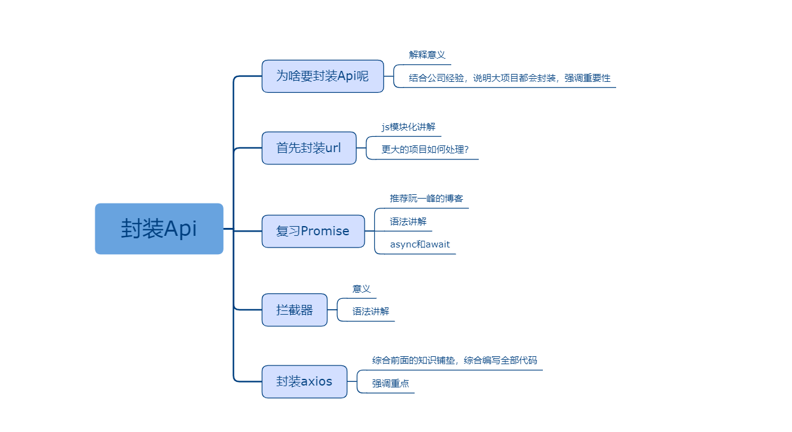

## 封装Api

### 课程目标

1. 讲解为什么要封装Api
2. 首先封装url
3. 其次要复习复习Promise
4. 讲解拦截器
5. 讲解封装本身代码

### 知识点

#### 1.为啥要封装Api呢
  为了好维护，减少代码量！把前后端通信的url单独写的一个文件里，有多少接口就一目了然了。把所有前端发起请求的方法也写到一个文件里，方法名抛出，可以减少代码量。另外还可以给axios添加拦截器，对报错信息统一处理，统一添加请求头等等。
  
#### 2.首先封装url
  封装url并没有用到啥新技术，js模块化而已！把url归归类，也可以写写注释，甚至还可以继续拆分成多个文件，多人协同维护。

  语法格式：
```js
const urls = {
  login: '/api/login',
  list: '/api/list',
  myBooks: '/api/my_books'
}

export default urls
```

#### 3.复习Promise
  axios请求本身就是一个promise，如果想对axios进行二次封装，要好好研究一下。promise对象是可以通过.then处理成功的回调的，在封装之前大家一直也都这么用，封装之后也需要继续保持。async函数本身也是一个promise，且async函数内部可以通过await等待异步函数执行。

#### 4.拦截器
  拦截器只是一个概念，其实很好理解。可以类比之前讲的express中间件，其实二者的语法格式都是一致的。重点不是语法，重点是拦截器能帮咱干啥。可以类比高速公路的上高速前领一张卡和下高速前把卡交回并缴费。回到拦截器里就是请求前可以在header里添加token等信息，请求后可以帮忙这一些消息框的提示拦截。

#### 5.封装axios
  这块是核心代码，会有点多，核心思想就是把请求的核心部分封装成一个函数，抛出多个函数对应多个接口。

  语法格式：
```js
import axios from 'axios'
import message from '../components/message'
import urls from './urls'

if (process.env.NODE_ENV === 'development') {
  axios.defaults.baseURL = 'http://localhost:81'
}

axios.interceptors.request.use((config) => {
  config.headers.token = localStorage.getItem('token')
  return config
})

axios.interceptors.response.use((res) => {
  if (res.data.code === 400) {
    message({ message: res.data.message, duration: 2000 })
  }
  return res
})

const common = async (config) => {
  let resolve = await axios(config)
  return resolve.data
}

const Api = {
  login: (data) => common({ url: urls.login, data, method: 'post' }),
  list: () => common({ url: urls.list }),
  myBooks: (data, method) => common({ url: urls.myBooks, data, method })
}

export default Api
```

### 授课思路



### 案例作业

1.登录页调用封装后的api  
2.在后端添加对一个数组的增删查改的接口    
3.前端封装对应的接口并调用  
4.研究get请求和post请求的区别     


