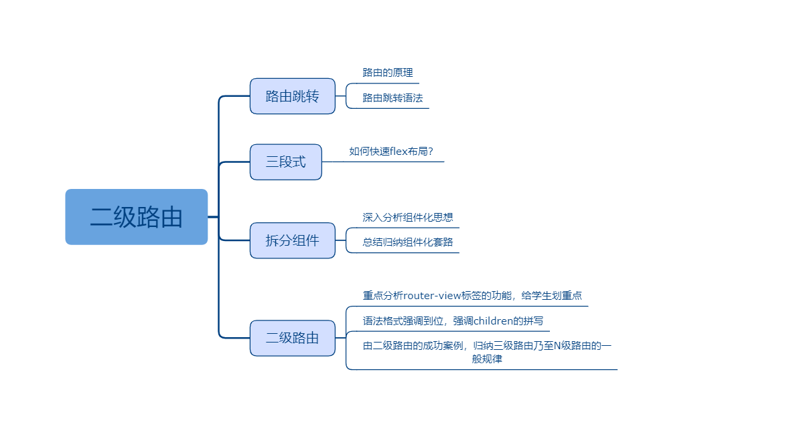

## 二级路由

### 课程目标

1. 登录后跳转到新页面
2. 新页面是个三段式
3. header、footer拆分成组件
4. 中间部分是二级路由，动态切换

### 知识点

#### 1.如何跳转路由
  如果用户名和密码都是正确的，后端会返回登录成功，前端就需要跳转页面了。可以给学生扩展一下路由的原理，history模式和hash模式到底啥区别？

  语法格式：
```js
  this.$router.push('/index/home')
```
  
#### 2.三段式
  盒子需要覆盖整个浏览器，flex纵向布局。头和尾高度固定，中间部分flex:1

```css
.m-wrap{display: flex;flex-direction: column;position: absolute;top: 0;left: 0;right: 0;bottom: 0;}
.m-header{height: 40px;line-height: 40px;background: red;color: #fff;text-align: center;}
.m-main{flex: 1;overflow-y: auto;}
.m-footer{display: flex; height: 40px;box-shadow: 0 -5px 5px rgba(0,0,0,0.1);border-top: 1px solid #ddd; text-align: center;z-index: 9;}
```  

#### 3.拆分组件
  组件化依然是主体，header和footer两个组件。这个两个组件还是有很多文章可以做的，可以简单讲一下先不展开，先把二级路由讲清楚！

```js
<template>
  <div class="m-wrap">
    <Header></Header>
    <router-view></router-view>
    <Footer></Footer>
  </div>
</template>
```  

#### 4.二级路由
  所谓二级，就是普通的页面里包含小页面。其实多少级都是一样的，学会二级就都学会了。router-view是页面渲染的地方，是可以嵌套。路由配置是数组对象，也可以通过children字段进行嵌套，和router-view形成对应。

  语法格式：
```js
const routes = [
  {
    path: '/index',
    component: Index,
    children: [{
      path: '/index/home',
      component: () => import('../views/Home')
    }]
  }
]

```

### 授课思路



### 案例作业

1.登录成功后跳转新页面   
2.新页面是三段式，头和尾是组件，中间是二级路由    
3.研究路由懒加载    
4.预习vuex     


