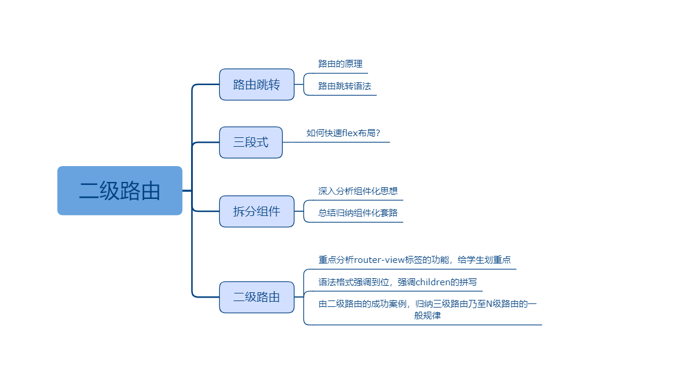

## 结合案例深入介绍VueX

### 课程目标

1. VueX
2. 新页面是个三段式
3. header、footer拆分成组件
4. 中间部分是二级路由，动态切换

### 知识点

#### 1.VueX
  VueX是难点、重点。可以以多举一些有趣的例子加深学生理解。比如好比是杂货铺，又好比是手机里的应用商店等等。还可以带着学生安装一下VueX在chrome里的插件,这样学习起来更直观些。这里把Vuex的最精简、最易上手的语法展示一下，学会这些就足够了，不必全面学习官方Api。

  语法格式：
```js
import Vue from 'vue'
import Vuex from 'vuex'
import Api from '../api'

Vue.use(Vuex)

export default new Vuex.Store({
  state: {
    title: '小米书城'
  },
  mutations: {
    setState(state, payload) {
      state[payload.key] = payload.value
    }
  },
  actions: {
    getList({ commit }) {
      Api.list().then(res => {
        if (res.code === 200) {
          commit({ type: 'setState', key: 'list', value: res.data })
        }
      })
    }
  }
})

```
  title是仓库里的值，mutations里的setState方法负责修改仓库里的值，actions只是一个写异步函数的地方。
  
#### 2.在header里获取仓库里的值
  通过计算属性获取，语法很简单，获取之后的使用也和data里的数据完全一样。当然也可以使用辅助函数获取。

```js
<template>
  <div class="m-header">
    {{title}}
  </div>
</template>

<script>
export default {
  computed: {
    title() {
      return this.$store.state.title
    }
  }
}
</script>
```  

#### 3.在footer里修改仓库里的值
  组件化依然是主体，header和footer两个组件。这个两个组件还是有很多文章可以做的，可以简单讲一下先不展开，先把二级路由讲清楚！

```js
<template>
  <div class="m-wrap">
    <Header></Header>
    <router-view></router-view>
    <Footer></Footer>
  </div>
</template>
```  

#### 4.二级路由
  所谓二级，就是普通的页面里包含小页面。其实多少级都是一样的，学会二级就都学会了。router-view是页面渲染的地方，是可以嵌套。路由配置是数组对象，也可以通过children字段进行嵌套，和router-view形成对应。

  语法格式：
```js
const routes = [
  {
    path: '/index',
    component: Index,
    children: [{
      path: '/index/home',
      component: () => import('../views/Home')
    }]
  }
]

```

### 授课思路



### 案例作业

1.登录成功后跳转新页面   
2.新页面是三段式，头和尾是组件，中间是二级路由    
3.研究路由懒加载    
4.预习vuex     


