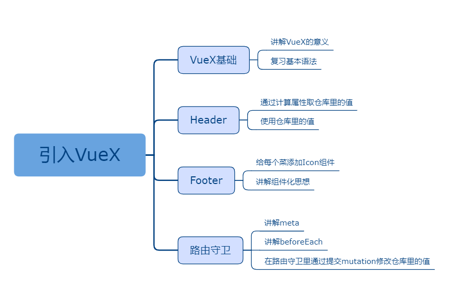
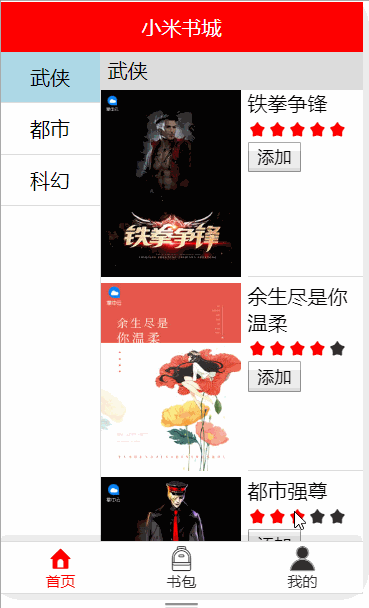

## 引入VueX

### 课程目标

1. 通过案例引入VueX
2. 让学生掌握VueX的基本语法
3. 了解路由守卫

### 知识点

#### 1.VueX
  VueX是难点、重点。可以多举一些有趣的例子加深学生理解。仓库好比是杂货铺，又好比是手机里的应用商店等等。还可以带着学生安装一下VueX在chrome里的插件,这样学习起来更直观些。这里把Vuex的最精简、最易上手的语法展示一下，学会这些就足够了，不必全面学习官方Api。

  语法格式：
```js
import Vue from 'vue'
import Vuex from 'vuex'
import Api from '../api'

Vue.use(Vuex)

export default new Vuex.Store({
  state: {
    title: '小米书城'
  },
  mutations: {
    setState(state, payload) {
      state[payload.key] = payload.value
    }
  },
  actions: {
    getList({ commit }) {
      Api.list().then(res => {
        if (res.code === 200) {
          commit({ type: 'setState', key: 'list', value: res.data })
        }
      })
    }
  }
})

```
  title是仓库里的值，mutations里的setState方法负责修改仓库里的值，actions只是一个写异步函数的地方。
  
#### 2.在Header里获取仓库里的值
  通过计算属性获取，语法很简单，获取之后的使用也和data里的数据完全一样。当然也可以使用辅助函数获取，不过我不喜欢使用。

```js
<template>
  <div class="m-header">
    {{title}}
  </div>
</template>

<script>
export default {
  computed: {
    title() {
      return this.$store.state.title
    }
  }
}
</script>
```  

#### 3.完善Footer组件
  Footer组件包含首页、书包和我的三个菜单，除了文字外，应该添加上小图标，这样会更加有趣！之前的课程中已经封装了Icon组件在密码输入框里使用，这里是第二次是否Icon组件，Icon组件还会再接下来的课程中继续使用。

```js
<template>
  <div class="m-footer">
    <router-link to="/index/home" class="m-footer-item">
      <Icon name="shouye" class="m-footer-icon"></Icon>
      <div class="m-footer-text">首页</div>
    </router-link>
    <router-link to="/index/my_books" class="m-footer-item">
      <Icon name="shubao" class="m-footer-icon"></Icon>
      <div class="m-footer-text">书包</div>
    </router-link>
    <router-link to="/index/me" class="m-footer-item">
      <Icon name="wodedangxuan" class="m-footer-icon"></Icon>
      <div class="m-footer-text">我的</div>
    </router-link>
  </div>
</template>
```  

#### 4.点击底部菜单动态修改Header里的文本
  如果直接在底部菜单上面绑定click事件，点击的时候修改仓库里的title值，确实可以实现这个需求，但是刷新后会出bug，你可以试一试！原因很简单，store里的数据刷新后就回到初始值了。这里推荐一个新的解决方案，通过路由守卫实现！

  语法格式：
```js
  children: [{
    path: '/index/home',
    component: () => import('../views/Home'),
    meta: {
      title: '小米书城'
    }
  }, {
    path: '/index/my_books',
    component: () => import('../views/MyBooks'),
    meta: {
      title: '我的书包'
    }
  }, {
    path: '/index/me',
    component: () => import('../views/Me'),
    meta: {
      title: '个人中心'
    }
  }]

router.beforeEach((to, from, next) => {
  store.commit({ type: 'setState', key: 'title', value: to.meta.title })
  next()
})

```

### 授课思路



### 案例作业

1.学习VueX语法   
2.实现底部菜单切换顶部Header文本    
3.学习Icon组件      
4.学习actions     




