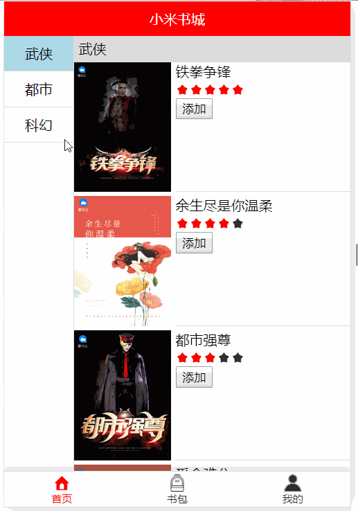

## 楼层

### 课程目标

1. 深入掌握VueX
2. 深入掌握组件化思想
3. 搭建楼层页面框架

### 知识点

#### 1.VueX之actions
  actions是写异步函数的地方，通过异步请求获取数据。函数的第一个参数是context，context里包含state、commit等。通过commit把获取的数据提交给mutations，然后更新state。这是VueX给咱们设计出来的一套语法格式。

```js
import Vue from 'vue'
import Vuex from 'vuex'
import Api from '../api'

Vue.use(Vuex)

export default new Vuex.Store({
  state: {
    title: '小米书城',
    list: [],
  },
  mutations: {
    setState(state, payload) {
      state[payload.key] = payload.value
    }
  },
  actions: {
    getList({ commit }) {
      Api.list().then(res => {
        if (res.code === 200) {
          commit({ type: 'setState', key: 'list', value: res.data })
        }
      })
    }
  }
})
```
  actions里的函数并不会自动触发，可以在组件挂载后这个生命周期里手动触发。

```js
  mounted() {
    this.$store.dispatch({ type: 'getList' })
  }
```
  
#### 2.初始楼层页面
  通过计算属性可以获取仓库里的数据。无论是哪个组件，都可以随时随地的获得仓库里的数据。我们在首页里使用两个组件，一个是侧边栏，另一个是列表。点击侧边栏的菜单可以控制列表滚动到对应的数据位置，同时右侧数据滚动时，侧边栏菜单的高亮也会有所变化，其实就是楼层的效果！

  这是首页的代码，可以清醒的看到使用了侧边栏组件和列表组件，以及在挂载完这个生命周期派发了getList这个action去请求数据
```js
<template>
  <div class="m-main m-home">
    <Sidebar></Sidebar>
    <List></List>
  </div>
</template>

<script>
import Sidebar from '../components/Sidebar'
import List from '../components/List'

export default {
  components: {
    Sidebar,
    List
  },
  mounted() {
    this.$store.dispatch({ type: 'getList' })
  }
}
</script>
```  

#### 3.侧边栏组件
  侧边栏里有菜单，菜单的数据需要从仓库里获得，仓库里的list数据是一个数组。

  

  我们需要使用v-for把数组里的第一层的title字段渲染成菜单，并给每一个菜单菜单绑定点击事件，通过点击事件控制仓库里的currentId，该字段和菜单的高亮有关。
```js
<template>
  <div class="m-sidebar">
    <div 
      v-for="item in list" 
      :key="item.id" 
      class="m-sidebar-item" 
      :class="currentId === item.id ? 'active' : ''"
      @click="handleNav(item.id)">{{item.title}}</div>
  </div>
</template>

<script>
let timer

export default {
  computed: {
    list() {
      return this.$store.state.list
    },
    currentId() {
      return this.$store.state.currentId
    }
  },
  methods: {
    handleNav(id) {
      this.$store.commit({ type: 'setState', key: 'currentId', value: id })
    }
  }
}
</script>
```  

#### 4.List组件
  List组件这节课并不讲太多内容，先渲染一下列表即可！渲染的时候需要注意一下这是一个两层的数组，第一层是分类，第二层是分类对应的列表。

```js
<template>
  <div class="m-list">
    <div v-for="categroy in list" :key="categroy.id" :id="categroy.id" class="m-category js-category">
      <div class="m-category-title">{{categroy.title}}</div>
      <div v-for="book in categroy.list" :key="book.id" class="m-list-item">
        <div class="m-info">
          {{book.title}}
        </div>
      </div>
    </div>
  </div>
</template>

<script>
export default {
  computed: {
    list() {
      return this.$store.state.list
    }
  },
}
</script>
```

### 授课思路


### 案例作业

1.编辑actions函数并把返回的数据保存到仓库   
2.搭建楼层页面框架    
3.开发侧边栏组件并添加高亮      
4.开发列表组件     




