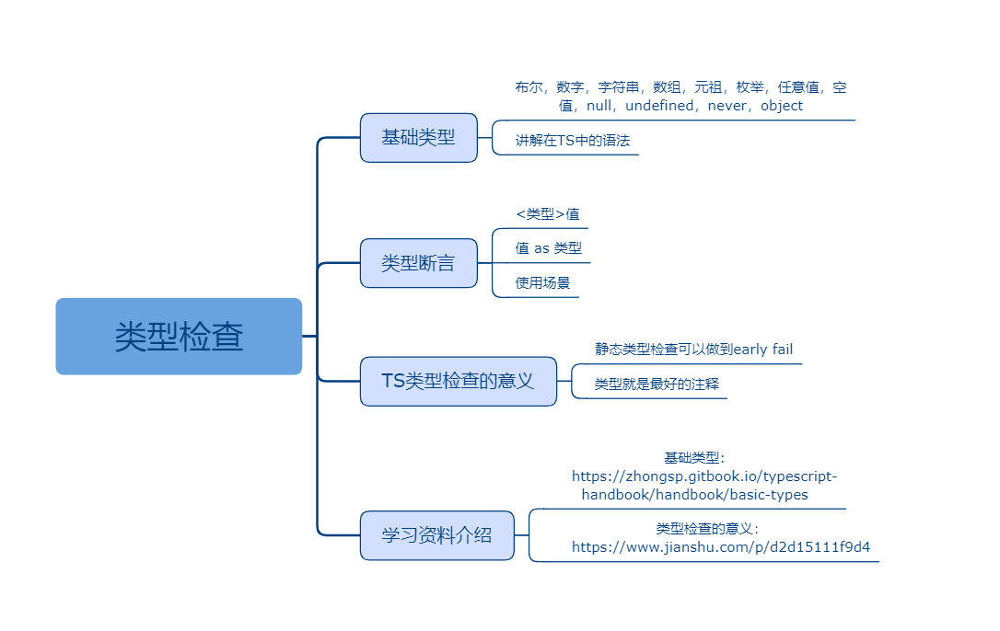

## 类型检查

### 课程目标

1. 基础类型
2. 类型断言
3. TS类型检查的意义
4. 学习资料介绍

### 知识点

#### 1.基础类型
    布尔，数字，字符串，数组，元祖，枚举，任意值，空值，null，undefined，never，object

```js
//布尔
let isDone: boolean = true

//数字
let count: number = 1

//字符串
let username: string = 'admin'

//数组
let list: number[] = [1, 2, 3]
let listPlus: Array<number> = [1, 2, 3]

//元组 Tuple
let x: [string, number]
x = ['hello', 10]

//枚举
enum Color { Red, Green, Blue }
let c: Color = Color.Green

//任意值
let notSure: any = 1
notSure = 'xu'
notSure = true

//空值
function greeter(): void {
  console.log('hello')
}

//null
let u:undefined = undefined
let n:null = null

//需要开启： "strictNullChecks": false
let num:number = null
let str1:string = undefined

//never 类型表示的是那些永不存在的值的类型
// 返回never的函数必须存在无法达到的终点
function error(message: string): never {
  throw new Error(message);
}

// 推断的返回值类型为never
function fail() {
  return error("Something failed");
}

// 返回never的函数必须存在无法达到的终点
function infiniteLoop(): never {
  while (true) {
  }
}

//object
let obj:object = {}
```    
  
#### 2.类型断言
    有时候你会遇到这样的情况，你会比TypeScript更了解某个值的详细信息。 通常这会发生在你清楚地知道一个实体具有比它现有类型更确切的类型。
    通过类型断言这种方式可以告诉编译器，“相信我，我知道自己在干什么”。 类型断言好比其它语言里的类型转换，但是不进行特殊的数据检查和解构。 它没有运行时的影响，只是在编译阶段起作用。 TypeScript会假设你，程序员，已经进行了必须的检查。
    类型断言（Type Assertion）可以用来手动指定一个值的类型

语法：
```js
　<类型>值
```

或者
```js
　值 as 类型
```

实例：
```js
(window as any).username = 'admin'
console.log((this as any).username)
```

#### 3.TS类型检查的意义
    TS对JS的改进主要是静态类型检查，静态类型检查有何意义？标准答案是“静态类型更有利于构建大型应用”。为什么静态类型有利于构建大型应用？我总结，利在两点。

    其一，静态类型检查可以做到early fail，即你编写的代码即使没有被执行到，一旦你编写代码时发生类型不匹配，语言在编译阶段（解释执行也一样，可以在运行前）即可发现。针对大型应用，测试调试分支覆盖困难，很多代码并不一定能够在所有条件下执行到。而假如你的代码简单到任何改动都可以从UI体现出来，这确实跟大型应用搭不上关系，那么静态类型检查确实没什么作用。

    其二，类型就是最好的注释。静态类型对阅读代码是友好的，比如我们举个例子 jQuery API Documentation 这是大家都非常喜欢用的jQuery.ajax，在这份文档中，详尽地解释了类型为object的唯一一个参数settings，它是如此之复杂，如果没有文档，我们只看这个函数声明的话，根本不可能有人把这个用法猜对。针对大型应用，方法众多，调用关系复杂，不可能每个函数都有人编写细致的文档，所以静态类型就是非常重要的提示和约束。而假如你的代码像jQuery这样所有函数基本全是API，根本没什么内部函数，而且逻辑关系看起来显而易见，这确实跟大型应用搭不上关系，那么静态类型对阅读代码确实也没什么帮助。总的来说，现代编程语言设计，很多特性已经有非常成熟的理论支持了，如果我们重视计算机基础，那么一些语言的适用场景就像是拼积木，可以用几句话概括。像是TS对JS这样，只是单一特性变化。

#### 4.学习资料介绍
    基础类型:
    https://zhongsp.gitbook.io/typescript-handbook/handbook/basic-types
    类型检查的意义：
    https://www.jianshu.com/p/d2d15111f9d4

### 授课思路

 

### 案例作业

1.练习TS里的类型检查   
2.使用类型断言  
3.深入思考TS类型检查的意义  
4.预习变量声明  

