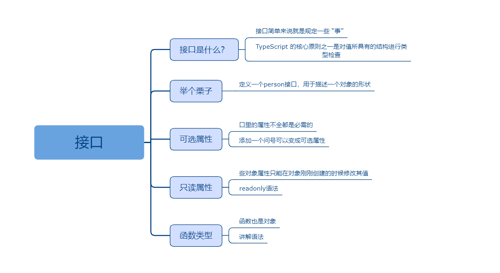

## 接口

### 课程目标

1. 接口是什么
2. 举个栗子
3. 可选属性
4. 只读属性
5. 函数类型

### 知识点

#### 1.接口是什么
    接口简单来说就是规定一些 “事”，在后台中，接口指的是双方规定的 API，在 TS 里接口一般指这个变量拥有什么东西。
    TypeScript 的核心原则之一是对值所具有的结构进行类型检查。 它有时被称做“鸭式辨型法”或“结构性子类型化”。 在 TypeScript 里，接口的作用就是为这些类型命名和为你的代码或第三方代码定义契约。
    接口一般是用来定义一组规范，比如我们常说的usb接口就是一种电脑外设的规范，不管是鼠标还是键盘还是u盘，只要符合这个规范的外设都可以插入这个接口。
    使用usb接口可以降低鼠标键盘这些外设和笔记本电脑的耦合性。


#### 2.举个栗子

```js
//定义一个person接口，用于描述一个对象的形状：必须包含name属性，且类型为string
interface Person {
  name: string
}

//Person接口就像一个普通类型一样去使用
function greeter(person: Person) {
  return `hello world!${person.name}`
}

//xu这个对象满足Person接口的约束，如果不满足，编译器会立马报错,这既是类型检查的意义所在
let xu:Person = {
  name: 'xu'
}

document.body.innerHTML = greeter(xu)
```
    

#### 3.可选属性
    接口里的属性不全都是必需的。 有些是只在某些条件下存在，或者根本不存在。

```js
//添加一个问号可以变成可选属性
interface Person {
  name: string,
  age?: number
}

//Person接口就像一个普通类型一样去使用
function greeter(person: Person) {
  return `hello world!${person.name}`
}

//xu对象可以不包含age属性
let xu:Person = {
  name: 'xu'
}

document.body.innerHTML = greeter(xu)
```    
    

#### 4.只读属性
    些对象属性只能在对象刚刚创建的时候修改其值。 你可以在属性名前用readonly来指定只读属性

```js
//添加一个问号可以变成可选属性
interface Person {
  readonly name: string,
  age: number
}

//Person接口就像一个普通类型一样去使用
function greeter(person: Person) {
  return `hello world!${person.name}`
}

//xu对象可以不包含age属性
let xu:Person = {
  name: 'xu',
  age: 30
}

//可以修改age
xu.age = 31

//但是不可以修改name，不过只是类型检查时报个错，其实修改是并没有被阻止
xu.name = '徐'

document.body.innerHTML = greeter(xu)
```    
#### 5.函数类型
    接口能够描述 JavaScript 中对象拥有的各种各样的外形。 除了描述带有属性的普通对象外，接口也可以描述函数类型。
    为了使用接口表示函数类型，我们需要给接口定义一个调用签名。 它就像是一个只有参数列表和返回值类型的函数定义。参数列表里的每个参数都需要名字和类型。  
    因为函数也是对象，所以我们也可以通过接口来对函数做“规定”。

```js
//函数类型
interface Greeter {
  (name:string): string
}

let greeter: Greeter

//Person接口就像一个普通类型一样去使用
greeter = function (name:string) {
  return `hello world!${name}`
}

document.body.innerHTML = greeter('xu')
```      

### 授课思路

 

### 案例作业

1.研究接口含义   
2.定义普通的对象接口  
3.编写可选属性和只读属性  
4.编写函数接口  
5.预习TS中的类(class)  

