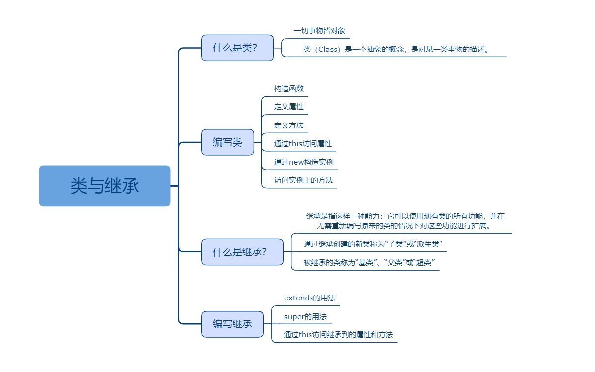

## 类与继承

### 课程目标

1. 什么是类
2. 编写类
3. 什么是继承
4. 编写继承

### 知识点

#### 1.什么是类
    一切事物皆对象，通过面向对象的方式，将现实世界的事物抽象成对象，现实世界中的关系抽象成类、继承，帮助人们实现对现实世界的抽象与数字建模。
    面向对象的最基础的单元就是类。类（Class）是一个抽象的概念，是对某一类事物的描述。例如：猫，狗，人。而对象（object）就是类的实例化。即符合类描述的具体的单个成员。
    什么是类,类不是一个实体的存在,比如手机这个类,手机并不是实体,如iPhone7 才是一个实体,手机并不是,类只是一个模子,确定对象将会有的特征(属性)和行为(方法)。
    类 : 具有相同属性和技能的一类事物(类后面的变量需要首字母大写)。
    对象:具体类的表现,具体实实在在的一个实例。
    人是一个类,爱因斯坦是一个对象。
    狗是一个类,球球是一个对象。
    传统的JavaScript程序使用函数和基于原型的继承来创建可重用的组件，但对于熟悉使用面向对象方式的程序员来讲就有些棘手，因为他们用的是基于类的继承并且对象是由类构建出来的。 从ECMAScript 2015，也就是ECMAScript 6开始，JavaScript程序员将能够使用基于类的面向对象的方式。 使用TypeScript，我们允许开发者现在就使用这些特性，并且编译后的JavaScript可以在所有主流浏览器和平台上运行，而不需要等到下个JavaScript版本。

#### 2.编写类

```js
//定义一个类
class Greeter {
  //定义类的属性
  name: string

  //构造函数
  constructor(name: string) {
    this.name = name
  }

  //定义类的方法
  greet() {
    //访问内的程序时使用this
    document.body.innerHTML = `hello world!${this.name}`
  }
}

//使用new 构造了Greeter类的一个实例。它会调用之前定义的构造函数，创建一个Greeter类型的新对象，并执行构造函数初始化它。
let greeter = new Greeter('xu')

//这个对象具有打招呼的行为
greeter.greet()
```

#### 3.什么是继承
    基于类的程序设计中一种最基本的模式是允许使用继承来扩展现有的类。
    继承是指这样一种能力：它可以使用现有类的所有功能，并在无需重新编写原来的类的情况下对这些功能进行扩展。
    通过继承创建的新类称为“子类”或“派生类”。
    被继承的类称为“基类”、“父类”或“超类”。
    继承的过程，就是从一般到特殊的过程。
    

#### 4.编写继承    
```js
//定义一个类
class Person {
  name: string
  constructor(name: string) {
    this.name = name
  }
  say() {
    console.log(`${this.name}:hello!大家好！`)
  }
}

//Teacher类继承了Person类，拥有了name属性和say方法
class Teacher extends Person {
  //增加自己的course属性
  course: string
  constructor(name:string, course:string) {
    super(name)
    this.course = course
  }
  //增加自己的teach方法
  teach() {
    //调用继承的方法
    this.say()
    //访问继承的属性
    console.log(`${this.name}:我要讲的课程是${this.course}!`)
  }
}

let teacher = new Teacher('徐同保', 'Vue')
teacher.teach()

```    
    
### 授课思路

 

### 案例作业

1.研究类含义   
2.编写类代码  
3.研究继承的含义  
4.编写继承代码    

