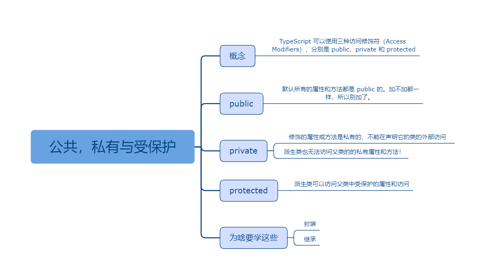

## 公共，私有与受保护的修饰符

### 课程目标

1. 概念
2. public
3. private
4. protected
5. 为啥要学这些

### 知识点

#### 1.概念
    public private 和 protected
    TypeScript 可以使用三种访问修饰符（Access Modifiers），分别是 public、private 和 protected。
    public 修饰的属性或方法是公有的，可以在任何地方被访问到，默认所有的属性和方法都是 public 的
    private 修饰的属性或方法是私有的，不能在声明它的类的外部访问
    protected 修饰的属性或方法是受保护的，它和 private 类似，区别是它在子类中也是允许被访问的

#### 2.public
    默认所有的属性和方法都是 public 的。加不加都一样，所以别加了。
```js
//定义一个类
class Person {
  public name: string
  constructor(name: string) {
    this.name = name
  }
  public say() {
    console.log(`${this.name}:hello!大家好！`)
  }
}
```

#### 3.private  
```js
//定义一个类
class Person {
  private name: string
  constructor(name: string) {
    this.name = name
  }
  private say() {
    console.log(`${this.name}:hello!大家好！`)
  }
}

let person = new Person('xu')
//访问私有属性会报错
console.log(person.name)
//访问私有方法会报错
person.say()
```    
    注意：派生类也无法访问父类的的私有属性和方法！

#### 4.protected
    派生类可以访问父类中受保护的属性和访问。    
```js
//定义一个类
class Person {
  protected name: string
  constructor(name: string) {
    this.name = name
  }
  protected say() {
    console.log(`${this.name}:hello!大家好！`)
  }
}

//Teacher类继承了Person类，拥有了name属性和say方法
class Teacher extends Person {
  //增加自己的course属性
  course: string
  constructor(name:string, course:string) {
    super(name)
    this.course = course
  }
  //增加自己的teach方法
  teach() {
    //调用继承的方法
    this.say()
    //访问继承的属性
    console.log(`${this.name}:我要讲的课程是${this.course}!`)
  }
}

let teacher = new Teacher('徐同保', 'Vue')
teacher.teach()
```    

#### 5.为啥要学这些
    封装就是隐藏对象的属性和实现细节，仅对外公开接口，控制在程序中属性的读和修改的访问级别，将抽象得到的数据和行为（或功能）相结合，形成一个有机的整体，也就是将数据与操作数据的源代码进行有机的结合，形成“类”，其中数据和函数都是类的成员。

    封装的目的是增强安全性和简化编程，使用者不必了解具体的实现细节，而只是要通过外部接口，以特定的访问权限来使用类的成员。
    可以举个栗子，录音机就是封装的栗子，内部的结构是私有的，用户无法访问，播放键，快进键是共有的，用户可以访问。

    继承是指这样一种能力：它可以使用现有类的所有功能，并在无需重新编写原来的类的情况下对这些功能进行扩展。

    如果没有protect，父类的属性和方法只能是public和private，对应一些需要继承但是有不想暴露的属性和方法就无能无力了。
    
### 授课思路

 

### 案例作业

1.研究私有属性的含义   
2.研究受保护属性的含义  
3.编写代码实现封装和继承  
4.预习面向对象三大特征    

