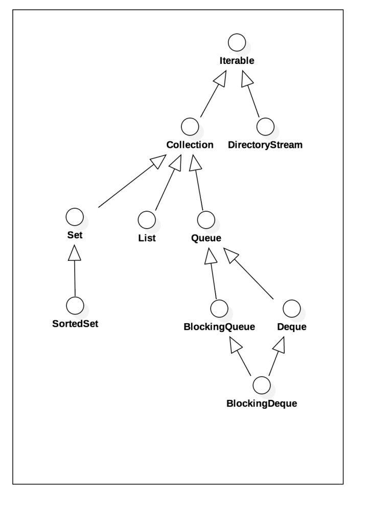
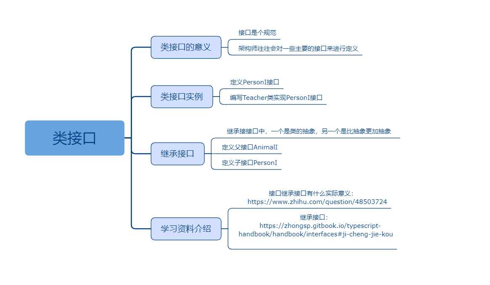

## 类接口

### 课程目标

1. 类接口的意义
2. 类接口实例
3. 继承接口
4. 学习资料介绍

### 知识点

#### 1.类接口的意义
    为什么需要一个接口，一个接口的实现类？接口是个规范。统一标准的目的，是大家都知道这个是做什么的，但是具体不用知道具体怎么做。定义接口有利于代码的规范：对于一个大型项目而言，架构师往往会对一些主要的接口来进行定义，或者清理一些没有必要的接口。这样做的目的一方面是为了给开发人员一个清晰的指示，告诉他们哪些业务需要实现；同时也能防止由于开发人员随意命名而导致的命名不清晰和代码混乱，影响开发效率。
    接口是一个标准，是一个约定，而不是一种实现，接口的目的是copy为了规范实现类，这样就可以不用具体管实现类，因为你不管怎么实现，我只要知道你百是实现了这个接口，那么你肯定有那些方法度，那么我调用这个接口的方法就肯定没问题。
    接口是一种高度的抽象，里面会规定一些将要实现的行为或者只作为一种标记。 

#### 2.类接口实例
    
```js
//架构师定义一个接口，告诉程序员按照这个规范去开发一个类
interface PersonI {
  name: string,
  say():void
}

//一个程序员用了三天的时间开发了一个Teacher类，这个类功能相当复杂
class Teacher implements PersonI {
  name: string
  constructor(name: string) {
    this.name = name
  }
  say() {
    console.log(`hello!大家好！我是${this.name}老师，今天咱们讲一下TS!`)
  }
}

//另一个程序员用了五天的时间开发了一个Student类，这个类的功能更复杂
class Student implements PersonI {
  name: string
  constructor(name: string) {
    this.name = name
  }
  say() {
    console.log(`老师好！我是${this.name},我写的代码有个报错，你帮我看看吧！`)
  }
}

//Teacher类和Student类是更庞大的在线教育项目的下面的若干类里的一员
//由于这个两个类都遵循相同的接口，所以使用起来很方便
let teacher = new Teacher('徐')
teacher.say()

let student = new Student('韩梅梅')
student.say()
```

#### 3.继承接口  
    接口是类的抽象。
    继承接口中，一个是类的抽象，另一个是比抽象更加抽象。
    这点和画家在创作时先画出轮廓，然后再一点一点的勾勒细节有异曲同工之妙。
    在由接口组成的继承层级中，从上往下看，是由抽象到具体的过程。通过继承我们可以保留父接口中定义的行为，同时对其可以做扩展。整个继承层级，其实是类似树结构的，树的层级越深，行为就更越复杂，能做的事情就更多。上一层是对下一层共性的抽象，下层是对上层不同维度的演进。
    因为对事物进行抽象的粒度是有粗细之分的。

 

```js
//任何动物都有名字
interface AnimalI {
  name: string
}

//不是所有动物都会说话，人会说话
interface PersonI extends AnimalI {
  say():void
}

//鸟会飞翔
interface BridI extends AnimalI {
  fly():void
}

//教师
class Teacher implements PersonI {
  name: string
  constructor(name: string) {
    this.name = name
  }
  say() {
    console.log(`hello!大家好！我是${this.name}老师，今天咱们讲一下TS!`)
  }
}

//鸟
class Brid implements BridI {
  name: string
  constructor(name: string) {
    this.name = name
  }
  fly() {
    console.log(`${this.name}会飞！`)
  }
}

let teacher = new Teacher('徐')
teacher.say()

let brid = new Brid('乌鸦')
brid.fly()

```    

#### 4.学习资料介绍
    接口继承接口有什么实际意义：
    https://www.zhihu.com/question/48503724
    继承接口：
    https://zhongsp.gitbook.io/typescript-handbook/handbook/interfaces#ji-cheng-jie-kou
    
### 授课思路

 

### 案例作业

1.定义类接口   
2.编写接口继承接口的代码  
3.上网阅读相关资料  
4.预习抽象类    

