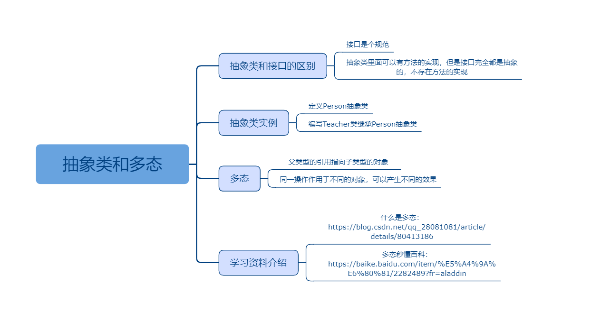

## 抽象类和多态

### 课程目标

1. 抽象类和接口的区别
2. 抽象类实例
3. 多态
4. 学习资料介绍

### 知识点

#### 1.抽象类和接口的区别
    抽象类
    抽象方法必须用abstract关键字进行修饰。如果一个类含有抽象方法，则称这个类为抽象类，抽象类必须在类前用abstract关键字修饰。
    抽象类就是为了继承而存在的
    如果一个类继承于一个抽象类，则子类必须实现父类的抽象方法。如果子类没有实现父类的抽象方法，则必须将子类也定义为为abstract类。

    抽象类和接口的区别：
    抽象类里面可以有方法的实现，但是接口完全都是抽象的，不存在方法的实现；
    子类只能继承一个抽象类，而接口可以被多个实现；
    抽象方法可以是public，protected，但是接口只能是public，默认的；
    抽象类可以有构造器，而接口不能有构造器；
    抽象类当做父类，被继承。且抽象类的派生类的构造函数中必须调用super()；接口可以当做“子类”继承其他类。

    抽象类与接口都无法实例化， 类类型接口实际上是一种 抽象类型。

    按个人理解，在使用类类型的接口时，类类型的接口其实就相当于抽象类的子集。抽象类中除了可以像接口那样只定义不实现外，还可以部分实现，而且也可以使用类型修饰符。

    类类型的接口更多的是当做一种抽象的数据类型使用，此处所说的类型通常是某个类的实例类型。
    接口中不能包含具体实现，抽象类中除抽象函数之外，其他函数可以包含具体实现。
    抽象类中的抽象方法在子类中必须实现， 接口中的非可选项在接口被调用时必须实现。
    抽象方法可当做类的实例方法，添加访问修饰符；但是接口不可以。
    抽象类: abstract 修饰， 里面可以没有抽象方法。但有抽象方法(abstract method)的类必须声明为抽象类(abstract class)

    抽象类的几个注意事项：

    1，抽象类使用abstract修饰

    2，抽象方法只能位于抽象类中

    3，抽象类不能实例化

    4，抽象方法没有方法体

    5，抽象类不能是静态类或者密封类

    6，子类必须重写父类的所有抽象方法，除非子类也是抽象类

    7，抽象类中可以有普通的方法

    8，抽象类中可以有构造函数

    9，抽象类中的抽象方法就是为了约束子类的方法形式。


#### 2.抽象类实例
    
```js
//抽象类，用于继承，不可以实例化
abstract class Person {
  name: string
  constructor(name: string) {
    this.name = name
  }
  say() {
    console.log(`hello!大家好！我是${this.name}!`)
  }
  //抽象方法
  abstract job(): void
}

class Teacher extends Person {
  constructor(name: string) {
    super(name)
  }
  job() {
    console.log('我的工作是讲课!')
  }
}

class Student extends Person {
  constructor(name: string) {
    super(name)
  }
  job() {
    console.log('我的工作是学习!')
  }
}

let teacher = new Teacher('徐同保')
teacher.say()
teacher.job()

let student = new Student('韩梅梅')
student.say()
student.job()
```

#### 3.多态  
    面试官：什么是多态呢？
    猪队友：多种形态，气体，液体，固体~
    面试官：go out! now!

    用最简单的一句话就是：父类型的引用指向子类型的对象。用一句比较通俗的话：同一操作作用于不同的对象，可以产生不同的效果。这就是多态。
    多种形态，既不同的对象对于同一个操作做出的响应不同。
    多态是同一个行为具有多个不同表现形式或形态的能力。多态就是同一个接口，使用不同的实例而执行不同操作。
    最终多态体现为父类引用变量可以指向子类对象。多态的前提是必须有子父类关系或者类实现接口关系，否则无法完成多态。
    在使用多态后的父类引用变量调用方法时，会调用子类重写后的方法。
    多态：同一操作作用于不同的对象，可以有不同的解释，产生不同的执行结果。在运行时，可以通过指向基类的指针，来调用实现派生类中的方法。

    格式：就是父类的引用变量指向子类对象
    父类类型  变量名 = new 子类类型();
    变量名.方法名();

```js
let teacher: Person = new Teacher('徐同保')
teacher.job()
```
    这句话很好理解：Person person = new Student("张三")；但是这个多态有什么作用呢？而我们又为什么要是有多态呢？

    首先讲下封装和继承：封装是把过程和数据包围起来，对数据的访问只能通过已定义的界面，他把实现的细节影藏起来了，比如你在java中去实现一个类，这个类中提供了一些功能方法，你只需要知道你需要传递什么样的参数，会达到什么样的效果，实现细节在类中定义好了。从而使得代码模块化；而继承可以扩展已存在的代码模块，而目的就是为了代码重用。

    那么多态除了代码的复用，还可以解耦。然而为什么要解耦？耦合度讲的是模块模块之间，代码代码之间的关联度，通过对系统的分析把他分解成一个一个子模块，子模块提供稳定的接口，达到降低系统耦合度的的目的，模块模块之间尽量使用模块接口访问，而不是随意引用其他模块的成员变量。

    多态有什么好处？

    有两个好处：

    1. 应用程序不必为每一个派生类编写功能调用，只需要对抽象基类进行处理即可。大大提高程序的可复用性。//继承 
    2. 派生类的功能可以被基类的方法或引用变量所调用，这叫向后兼容，可以提高可扩充性和可维护性。 //多态的真正作用，

#### 4.学习资料介绍
    什么是多态：
    https://blog.csdn.net/qq_28081081/article/details/80413186
    多态秒懂百科：
    https://baike.baidu.com/item/%E5%A4%9A%E6%80%81/2282489?fr=aladdin
    
### 授课思路

 

### 案例作业

1.定义抽象类   
2.学习多态的概念  
3.上网阅读相关资料  
4.预习泛型    

