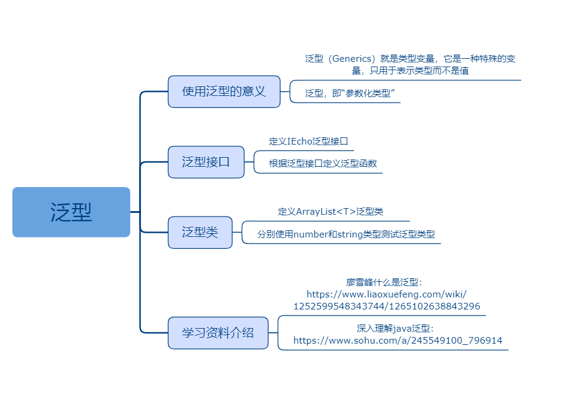

## 泛型

### 课程目标

1. 使用泛型的意义
2. 泛型接口
3. 泛型类
4. 学习资料介绍

### 知识点

#### 1.使用泛型的意义
    泛型（Generics）就是类型变量，它是一种特殊的变量，只用于表示类型而不是值。泛指的类型.
    T大约是"Type" 这个词的首字母。 a type variable.
    泛泛：一般，平常。交情不深的朋友。
    泛泛之交，意思是交情不深的朋友。
    泛泛来讲就是大概讲一下、从表面讲一下的意思。
    泛型：把类型明确的工作推迟到创建对象或调用方法的时候才去明确的特殊的类型。
    好处：
    代码更加简洁【不用强制转换】。
    程序更加健壮。
    可读性和稳定性【在编写集合的时候，就限定了类型】。

    泛型，即“参数化类型”。就是将类型由原来的具体的类型参数化，类似于方法中的变量参数，此时类型也定义成参数形式（可以称之为类型形参），然后在使用/调用时传入具体的类型（类型实参）。
    一些常用的泛型类型变量：
    E：元素（Element），多用于java集合框架  
    K：关键字（Key）  
    N：数字（Number）  
    T：类型（Type）  
    V：值（Value）

    使用泛型的意义：
    (1)适用于多种数据类型执行相同的代码（代码复用）
    (2)泛型中的类型在使用时指定，类型安全，编译器会检查类型


```js
function identity<T>(arg: T) {
  return arg
}

console.log(identity(1))
console.log(identity<string>('a'))
console.log(identity(true))
```

#### 2.泛型接口

```js
interface IEcho<T> {
  (arg: T): T
}

function echo<T>(arg: T) {
  return arg
}

let myEcho: IEcho<number> = echo
let myEcho2: IEcho<string> = echo

console.log(myEcho(1))
console.log(myEcho2('a'))
```
    

#### 3.泛型类  
```js
//泛型类
class ArrayList<T> {
  array: T[] = []
  size: number
  add(item: T) {
    this.array.push(item)
    this.size = this.array.length
  }
  //共用一套逻辑
  print() {
    console.log(`全部数据:${this.array.join(' ')}`)
  }
}

//创建对象时才明确类型
let numberList = new ArrayList<number>()
numberList.add(1) //如果是错误类型，会报错
numberList.add(2)
console.log(numberList.size)
numberList.print()

let strList = new ArrayList<string>()
strList.add('xu')
strList.add('徐')
strList.add('hello')
console.log(strList.size)
strList.print()

```    
#### 4.学习资料介绍
廖雪峰什么是泛型：
https://www.liaoxuefeng.com/wiki/1252599548343744/1265102638843296

深入理解java泛型：
https://www.sohu.com/a/245549100_796914
    
### 授课思路

 

### 案例作业

1.定义泛型类   
2.学习泛型了使用场景  
3.上网阅读相关资料  
4.预习装饰器    

