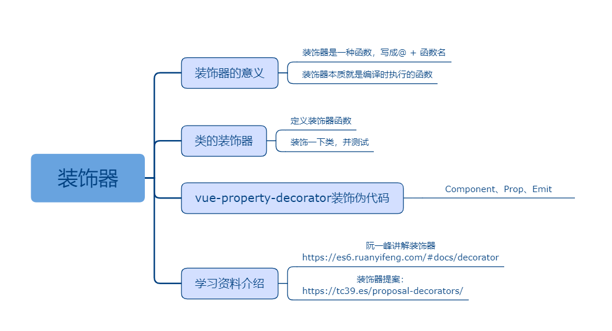

## 装饰器

### 课程目标

1. 装饰器的意义
2. 类的装饰器
3. vue-property-decorator装饰器伪代码
4. 学习资料介绍

### 知识点

#### 1.装饰器的意义
    Decorator 提案经过了大幅修改，目前还没有定案，不知道语法会不会再变。

    装饰器（Decorator）是一种与类（class）相关的语法，用来注释或修改类和类方法。许多面向对象的语言都有这项功能，目前有一个提案将其引入了 ECMAScript。

    装饰器是一种函数，写成@ + 函数名。它可以放在类和类方法的定义前面。

    它们不仅增加了代码的可读性，清晰地表达了意图，而且提供一种方便的手段，增加或修改类的功能。

    Decorator 是 ES7 的一个新语法，目前仍处于第2阶段提案中，正如其“装饰器”的叫法所表达的，他通过添加@方法名可以对一些对象进行装饰包装然后返回一个被包装过的对象，可以装饰的对象包括：类，属性，方法等。

    在 ES6 中增加了对类对象的相关定义和操作（比如 class 和 extends ），这就使得我们在多个不同类之间共享或者扩展一些方法或者行为的时候，变得并不是那么优雅。这个时候，我们就需要一种更优雅的方法来帮助我们完成这些事情。

    注意，装饰器对类的行为的改变，是代码编译时发生的，而不是在运行时。这意味着，装饰器能在编译阶段运行代码。也就是说，装饰器本质就是编译时执行的函数。

#### 2.类的装饰器
    Teacher和Student类被装饰上了新方法！

```js
const mixins = (obj: IObj) => (target:any) => {
  Object.assign(target.prototype, obj)
}

interface IObj {
  eat(): void
  walk(): void
}

let obj: IObj = {
  eat() {
    console.log('吃饭')
  },
  walk() {
    console.log('走路')
  }
}

@mixins(obj)
class Teacher {
  name: string
  constructor(name: string) {
    this.name = name
  }
  job() {
    console.log('讲课')
  }
}

@mixins(obj)
class Student {
  name: string
  constructor(name: string) {
    this.name = name
  }
  job() {
    console.log('学习')
  }
}

let teacher = new Teacher('徐同保')
teacher.job()

//@ts-ignore
teacher.eat()

let student = new Student('韩梅梅')

//@ts-ignore
student.walk()
```
#### 3.vue-property-decorator装饰器伪代码
    编写vue-property-decorator包提供的装饰器伪代码：Componetn、Prop、Emit。

```js
//类的装饰器，接收一个对象参数，对象参数可以包含一个components属性
//components属性的值表达要使用的组件
const Component = (obj: IComponent) => (target: any) => {
  Object.assign(target.prototype, obj)
}

//类属性的装饰器，可以设置属性的默认值
const Prop = (obj: IProp) => (target: any, key: string) => {
  target[key] = obj.default
}

//类方法的装饰器，类方法触发时，调用父组件传递过来的方法，参数是类方法的返回值
const Emit = (method: string) => (target: any, key: string, descriptor: any) => {
  let oldValue = descriptor.value

  descriptor.value = function() {
    
    let result = oldValue.apply(this, arguments)
    console.log(`触发父组件传递过来的方法：${method}(${JSON.stringify(result)})`)
  }
}

interface IComponent {
  components?: object
}

interface IProp {
  default: any
}

@Component({
  components: {
    Header: '组件'
  }
})
class Home {
  @Prop({ default: 'zhanwei' }) 
  name!: string

  @Emit('onClick')
  handleClick(id: number) {
    console.log('点击事件', this.name)
    return { id }
  }
}

let home = new Home()

//@ts-ignore
console.log(home.components)

console.log(home.name)

home.handleClick(1)
```

#### 4.学习资料介绍

阮一峰讲解装饰器
https://es6.ruanyifeng.com/#docs/decorator

装饰器提案：
https://tc39.es/proposal-decorators/
    
### 授课思路

 

### 案例作业

1.定义类的装饰器   
2.定义类属性和类方法的装饰器  
3.预习vue+ts      

