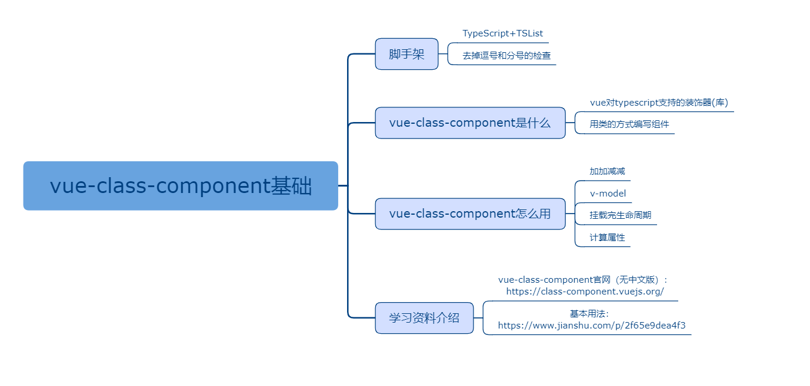

## vue-class-component基础

### 课程目标

1. 脚手架
2. vue-class-component是什么
3. vue-class-component怎么用
4. 学习资料介绍

### 知识点

#### 1.脚手架
    vue create m-app
    手动选择Typescript选项和TSLint选项
    报错问题：
    Missing trailing comma 缺少尾随逗号
    Missing semicolon 缺少分号
    解决方案：
    tslint.json文件里rules字段添加如下代码：
```json
    "trailing-comma": [false],
    "semicolon": [false]
```

#### 2.vue-class-component是什么
    vue-class-component 是尤雨溪推出的vue对typescript支持的装饰器(库)。
    vue-class-component 是 vue 的官方库，作用是用类的方式编写组件。
    vue-class-component强调了几点用法：
    1、methods可以直接声明为类成员方法
    2、computed属性可以声明为类属性访问器
    3、data数据可以声明为类属性
    4、data render 和所有Vue生命周期挂钩也可以直接声明为类成员方法，但不能在实例本身上调用它们。在声明自定义方法时，应避免使用这些保留名称。
    
#### 3.vue-class-component怎么用
  
加加减减：
```js
<template>
  <div>
    <div>{{count}}</div>
    <button @click="handleSub">减</button>
    <button @click="handleAdd">加</button>
  </div>
</template>

<script>
import Vue from 'vue'
import Component from 'vue-class-component'

@Component
class Login extends Vue {
  count = 0

  handleSub() {
    this.count--
  }
  
  handleAdd() {
    this.count++
  }
}

```
v-model:
```js
<template>
  <div>
    <input v-model="username">
  </div>
</template>

<script>
import Vue from 'vue'
import Component from 'vue-class-component'

@Component
class Login extends Vue {
  username = 'admin'
}

export default Login
</script>

```

挂载完生命周期:
```js
<template>
  <div>
    1
  </div>
</template>

<script>
import Vue from 'vue'
import Component from 'vue-class-component'

@Component
class Login extends Vue {
  mounted () {
    console.log('挂载完')
  }
}

export default Login
</script>

```

计算属性：
```js
<template>
  <div>
    {{double}}
  </div>
</template>

<script>
import Vue from 'vue'
import Component from 'vue-class-component'

@Component
class Login extends Vue {
  count = 1
  get double() {
    return this.count * 2
  }
}

export default Login
</script>

```
    
#### 4.学习资料介绍

vue-class-component官网（无中文版）：
https://class-component.vuejs.org/

基本用法：
https://www.jianshu.com/p/2f65e9dea4f3
    
### 授课思路

 

### 案例作业

1.通过脚手架搭建项目   
2.制作加加减减  
3.预习父子组件传值      

