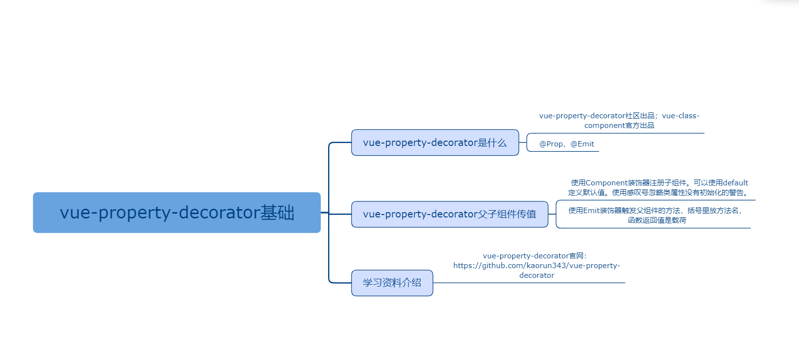

## vue-property-decorator基础

### 课程目标

1. vue-property-decorator是什么
2. vue-property-decorator父子组件传值
3. 学习资料介绍

### 知识点

#### 1.vue-property-decorator是什么
    vue-property-decorator社区出品；vue-class-component官方出品。
    vue-property-decorator深度依赖了vue-class-component，拓展出了更多操作符：@Prop、@Emit等。
    vue-property-decorator的作者是kaorun343（日本）。


#### 2.vue-class-component父子组件传值
    使用Component装饰器注册子组件。
父组件：
```js
<template>
  <div>
    <Icon :name="visible ? 'show' : 'hide'" @onClick="handleVisible"></Icon>
  </div>
</template>
<script lang="ts">
import { Vue, Component } from 'vue-property-decorator'
import Icon from '../components/Icon.vue'
@Component({
  components: {
    Icon
  }
})
class Login extends Vue {
  visible = false
  
  handleVisible(payload:object) {
    this.visible = !this.visible
  }
}
export default Login
</script>
```
    使用Prop装饰器获取父组件传递过来的值。可以使用default定义默认值。使用感叹号忽略类属性没有初始化的警告。
    使用Emit装饰器触发父组件的方法，括号里放方法名，函数返回值是载荷。

子组件：
```js
<template>
  <span :class="[`icon iconfont icon-${name} ${className}`]" @click="handleClick"></span>
</template>

<script lang="ts">
import { Vue, Component, Prop, Emit } from 'vue-property-decorator'

@Component
class Icon extends Vue {
  @Prop({ default: 'zhanwei' })
  name!: string

  @Prop({ default: '' })
  className!: string

  @Emit('onClick')
  handleClick() {
    return { id: 2 }
  }
}

export default Icon
</script>
```    

#### 3.学习资料介绍

vue-property-decorator官网：
https://github.com/kaorun343/vue-property-decorator

### 授课思路

 

### 案例作业

1.通过vue-property-decorator做父子组件传值   
2.上网查询相关质料  
3.预习vuex-class      

