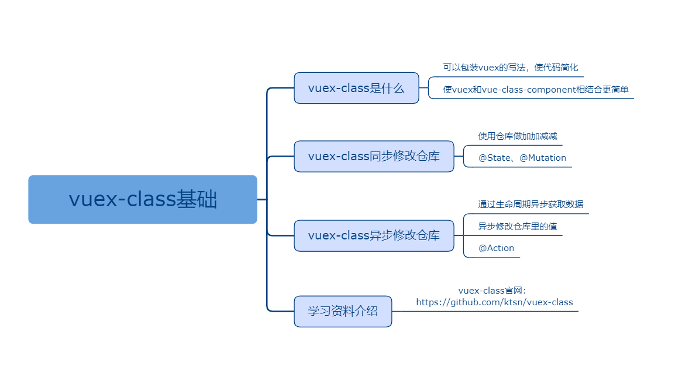

## vuex-class基础

### 课程目标

1. vuex-class是什么
2. vuex-class同步修改仓库
3. vuex-class异步修改仓库
4. 学习资料介绍

### 知识点

#### 1.vue-class是什么
    vuex-class可以包装vuex的写法，使代码简化。
    vuex-class使vuex和vue-class-component相结合更简单。
    vuex-class的作者是ktsn（新加坡）。

#### 2.vuex-class同步修改仓库
    使用仓库做加加减减。
    @State
    @Mutation

仓库：
```js
import Vue from 'vue'
import Vuex from 'vuex'

Vue.use(Vuex)

interface Payload {
  key: string,
  value: any
}

export default new Vuex.Store({
  state: {
    count: 0
  },
  mutations: {
    setState(state:any, payload:Payload) {
      state[payload.key] = payload.value
    }
  },
  actions: {
  },
  modules: {
  }
})

``` 

页面：
```js
<template>
  <div>
    <div>{{count}}</div>
    <button @click="handleSub">减</button>
    <button @click="handleAdd">加</button>
  </div>
</template>

<script lang="ts">
import Vue from 'vue'
import Component from 'vue-class-component'
import { State, Mutation } from 'vuex-class'

@Component
class Login extends Vue {
  @State('count') count!:number
  @Mutation('setState') setState!:Function

  handleSub() {
    let count = this.count - 1
    this.setState({ key: 'count', value: count })
  }

  handleAdd() {
    let count = this.count + 1
    this.setState({ key: 'count', value: count })
  }
}

export default Login
</script>

```
    
#### 3.vuex-class异步修改仓库
    @Action

获取数据：
```js
<template>
  <div class="m-main m-home">
    <Sidebar></Sidebar>
    <List></List>
  </div>
</template>

<script lang="ts">
import { Vue, Component } from 'vue-property-decorator'
import { Action } from 'vuex-class'
import Sidebar from '../components/Sidebar.vue'
import List from '../components/List.vue'

@Component({
  components: {
    Sidebar,
    List
  }
})
export default class Home extends Vue {
  @Action('list') list:any
  
  mounted() {
    this.list()
  }
}
</script>

<style>

</style>
```   

提交action并且带载荷：
```js
<script lang="ts">
import { Vue, Component, Prop } from 'vue-property-decorator'
import { State, Action } from 'vuex-class'

@Component
export default class MyBookItem extends Vue {
  @Prop() book!:any
  @State(state => state.myBooks) myBooks!: any[]
  @Action('myBooksAction') myBooksAction!:Function

  handleAdd(id:number) {
    this.myBooksAction({ data: { id, operation: 'add' }, method: 'patch' })
  }
  handleSub(id:number) {  
    this.myBooksAction({ data: { id, operation: 'sub' }, method: 'patch' })   
  }
  handleInput(id:number, e:any) {
    let myBooks = this.myBooks
    let count = e.target.value.replace(/[^\d]/g, '') - 0
    if (count === 0) {
      count = 1
    }
    this.myBooksAction({ data: { id, operation: 'inputCount', count }, method: 'patch' })
  }
  handleChecked(id:number, e:any) {
    this.myBooksAction({ data: { id, operation: 'checked', checked: e.target.checked }, method: 'patch' })
  }   
  handleDelete(id:number) {
    this.myBooksAction({ data: { ids: [id] }, method: 'delete' })
  }    
}
</script>
```
    
#### 4.学习资料介绍

vuex-class官网：
https://github.com/ktsn/vuex-class
    
### 授课思路

 

### 案例作业

1.使用vuex-class编写同步事件和异步事件   
2.上网查阅相关资料  
3.预习react+ts      

